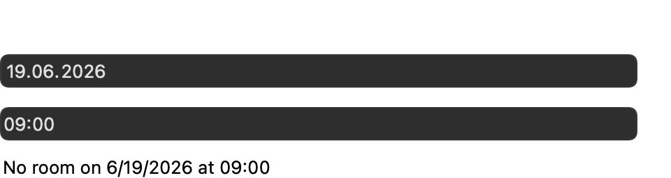
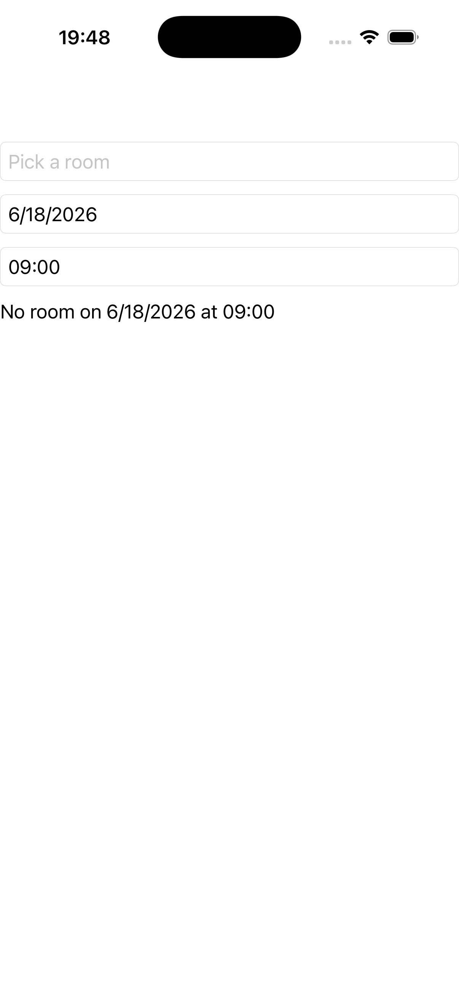

# Pickers

A `picker` (item list), a `date_picker`, and a `time_picker` on one stack, each selection driving a
readout label. Source: [`pickers_page.hpp`](../../../examples/gallery/pages/pickers_page.hpp).

| macOS (AppKit) | iOS (UIKit) |
| --- | --- |
|  |  |

**Running on iOS:**

**Native controls exercised:** `NSPopUpButton`/`UIPickerView`-backed field, `NSDatePicker`/`UIDatePicker`
(date + time modes), readout label.

**Platforms:** macOS ✅ demo · iOS ✅ demo · Windows ⬜ TODO · Linux ⬜ TODO · Android ⬜ TODO

**Run it:**
- macOS — `MAUI_SAMPLE_PAGE=pickers ./examples/build/gallery/gallery`
- iOS sim — `SIMCTL_CHILD_MAUI_SAMPLE_PAGE=pickers xcrun simctl launch booted dev.maui-cpp.ios-gallery`

> The iOS capture shows the date (`6/18/2026`) and time (`09:00`) fields and the room-picker placeholder,
> with the readout reflecting the current selection.
