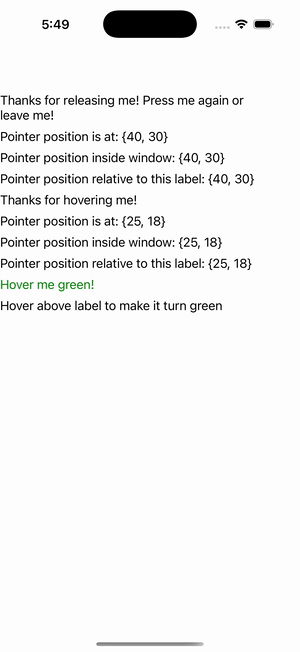

# Pointer Gestures

Ports .NET MAUI's `PointerGestureGalleryPage` ([oracle](../../../../../src/Controls/samples/Controls.Sample/Pages/Core/PointerGestureGalleryPage.xaml)) as a code-first `maui::samples::pointer_gesture_page`. PointerGestureRecognizer entered/moved/pressed/released/exited + the command path.

| macOS (AppKit) | iOS (UIKit) |
| --- | --- |
|  |  |

**Running on iOS:**

**Platforms:** macOS ✅ demo · iOS ✅ demo · Windows ⬜ TODO · Linux ⬜ TODO · Android ⬜ TODO

**Run it:** `MAUI_SAMPLE_PAGE=pointer_gesture ./build/apple/maui_macos_gallery` (macOS) · `SIMCTL_CHILD_MAUI_SAMPLE_PAGE=pointer_gesture xcrun simctl launch booted dev.maui-cpp.ios-gallery` (iOS)

> 3 PointerGestureRecognizers across 3 labels (entered/exited/moved/pressed/released + position readouts + per-phase background recolor) and the one-command/two-parameter PointerEntered/ExitedCommand path recoloring text Green-on-enter / Black-on-exit (via `try_unbox<color>`); a synthetic per-section `send_pointer_*` drive shows the readouts reacting. `PointerEventArgs.GetPosition(relativeTo)` is narrowed to one carried position (the per-target transform is the documented gap), so the readouts echo it under the C# captions.
