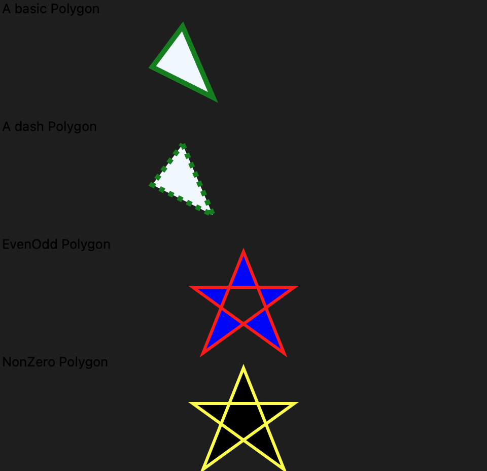
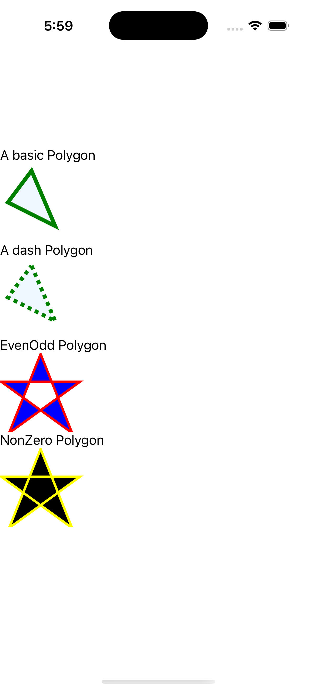

# Polygon Gallery

Ports .NET MAUI's `PolygonGallery` ([oracle](../../../../../src/Controls/samples/Controls.Sample/Pages/Controls/ShapesGalleries/PolygonGallery.xaml)) as a code-first `maui::samples::polygon_gallery_page`. Four polygons — the EvenOdd-vs-Nonzero fill-rule pair rendered exactly.

| macOS (AppKit) | iOS (UIKit) |
| --- | --- |
|  |  |

**Running on iOS:**

**Platforms:** macOS ✅ demo · iOS ✅ demo · Windows ⬜ TODO · Linux ⬜ TODO · Android ⬜ TODO

**Run it:** `MAUI_SAMPLE_PAGE=polygon_gallery ./examples/build/gallery/gallery` (macOS) · `SIMCTL_CHILD_MAUI_SAMPLE_PAGE=polygon_gallery xcrun simctl launch booted dev.maui-cpp.ios-gallery` (iOS)

> These are **natively-rendered** shape demos — the Shape control family (`controls::shapes::*`) draws through the graphics_view / shape_view handler over a CoreGraphics canvas, so the geometry is real pixels on both Apple backends (not a readout). A basic AliceBlue/green triangle, a green dashed triangle, and the EvenOdd-vs-Nonzero pentagram pair (identical self-intersecting points 10,100 50,0 90,100 0,35 100,35): **EvenOdd renders a hollow white pentagon core, Nonzero renders it filled** — the fill-rule difference is visible in the capture. XAML resource styles inlined per-property.
