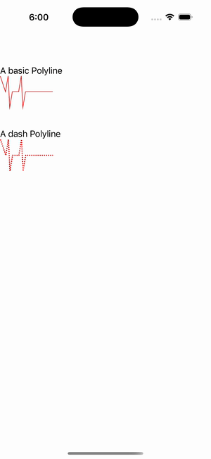

# Polyline Gallery

Ports .NET MAUI's `PolylineGallery` ([oracle](../../../../../src/Controls/samples/Controls.Sample/Pages/Controls/ShapesGalleries/PolylineGallery.xaml)) as a code-first `maui::samples::polyline_gallery_page`. Two open (non-auto-closed) polylines.

| macOS (AppKit) | iOS (UIKit) |
| --- | --- |
|  |  |

**Running on iOS:**

**Platforms:** macOS ✅ demo · iOS ✅ demo · Windows ⬜ TODO · Linux ⬜ TODO · Android ⬜ TODO

**Run it:** `MAUI_SAMPLE_PAGE=polyline_gallery ./examples/build/gallery/gallery` (macOS) · `SIMCTL_CHILD_MAUI_SAMPLE_PAGE=polyline_gallery xcrun simctl launch booted dev.maui-cpp.ios-gallery` (iOS)

> These are **natively-rendered** shape demos — the Shape control family (`controls::shapes::*`) draws through the graphics_view / shape_view handler over a CoreGraphics canvas, so the geometry is real pixels on both Apple backends (not a readout). A red 10-point zig-zag at default thickness and the same zig-zag with a red dashed stroke (thickness 2). Faithfully no ScrollView; the basic polyline keeps the default StrokeThickness.
