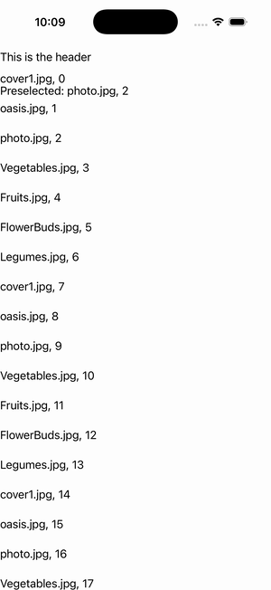

# CollectionView — Preselected Item

Ports .NET MAUI's `PreselectedItemGallery` ([oracle](../../../../../src/Controls/samples/Controls.Sample/Pages/Controls/CollectionViewGalleries/SelectionGalleries/PreselectedItemGallery.xaml)) as a code-first `maui::samples::preselected_item_page`. A Single-mode CollectionView with the index-2 item preselected at startup via SelectedItem set **before** SelectionMode=Single (the code-behind ordering), with a Header + the two diagnostic SelectedItems labels the XAML carries + a readout of the preselected caption. (The single-selection sibling of the Multiple-mode PreselectedItems page.)

| macOS (AppKit) | iOS (UIKit) |
| --- | --- |
|  |  |

**Running on iOS:**

**Platforms:** macOS ✅ demo · iOS ✅ demo · Windows ⬜ TODO · Linux ⬜ TODO · Android ⬜ TODO

**Run it:** `MAUI_SAMPLE_PAGE=preselected_item ./examples/build/gallery/gallery` (macOS) · `SIMCTL_CHILD_MAUI_SAMPLE_PAGE=preselected_item xcrun simctl launch booted dev.maui-cpp.ios-gallery` (iOS)
