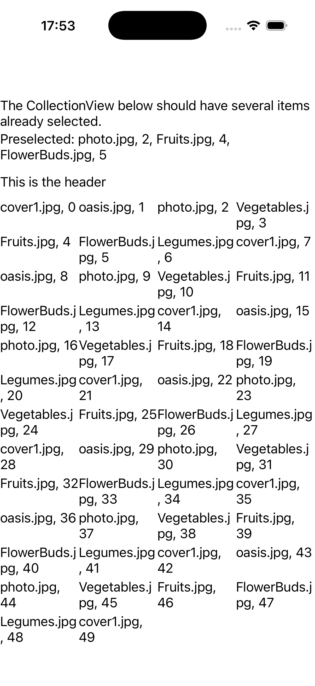
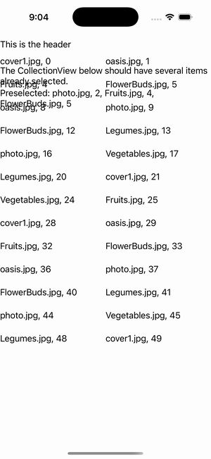

# CollectionView — Preselected Items

Ports .NET MAUI's `PreselectedItemsGallery` ([oracle](../../../../../src/Controls/samples/Controls.Sample/Pages/Controls/CollectionViewGalleries/SelectionGalleries/PreselectedItemsGallery.xaml)) as a code-first `maui::samples::preselected_items_page`. A GridItemsLayout Span=4 over a 50-item source with three items (indices 2/4/5) preselected at startup via the bound SelectedItems **before** switching to SelectionMode=Multiple (verbatim code-behind ordering), with a readout of the preselected captions.

| macOS (AppKit) | iOS (UIKit) |
| --- | --- |
|  |  |

**Running on iOS:**

**Platforms:** macOS ✅ demo · iOS ✅ demo · Windows ⬜ TODO · Linux ⬜ TODO · Android ⬜ TODO

**Run it:** `MAUI_SAMPLE_PAGE=preselected_items ./examples/build/gallery/gallery` (macOS) · `SIMCTL_CHILD_MAUI_SAMPLE_PAGE=preselected_items xcrun simctl launch booted dev.maui-cpp.ios-gallery` (iOS)

> Struct-typed item cells render their template-bound content natively (post the TemplatedCell.Bind fix).
