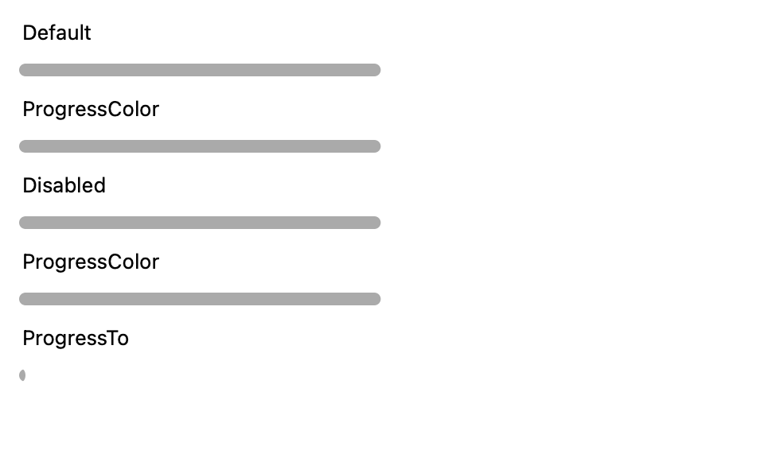
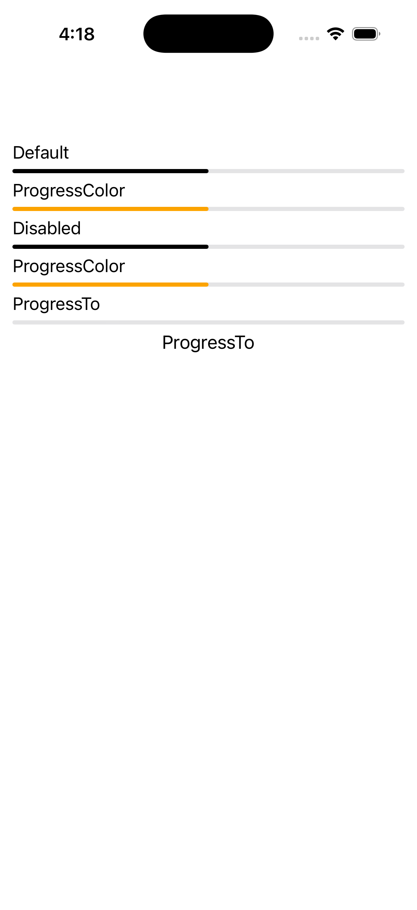
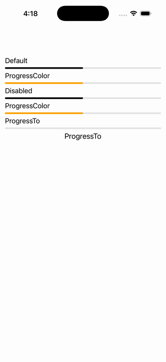

# ProgressBar

Ports .NET MAUI's `ProgressBarPage` ([oracle](../../../../../src/Controls/samples/Controls.Sample/Pages/Controls/ProgressBarPage.xaml)) as a code-first `maui::samples::progress_bar_page`. Default (0.5), ProgressColor=Orange, Disabled, a second ProgressColor pair, and a ProgressTo bar driven by a button.

| macOS (AppKit) | iOS (UIKit) |
| --- | --- |
|  |  |

**Running on iOS:**

**Platforms:** macOS ✅ demo · iOS ✅ demo · Windows ⬜ TODO · Linux ⬜ TODO · Android ⬜ TODO

**Run it:**
- macOS — `MAUI_SAMPLE_PAGE=progress_bar ./examples/build/gallery/gallery`
- iOS sim — `SIMCTL_CHILD_MAUI_SAMPLE_PAGE=progress_bar xcrun simctl launch booted dev.maui-cpp.ios-gallery`

> Notes: `ProgressTo(value,length,easing)` animation is deferred in the port, so the button sets Progress=1.0 directly (the animation's end state).
