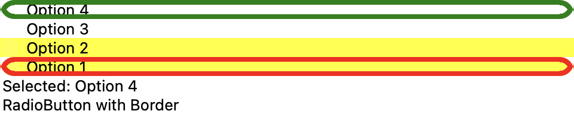
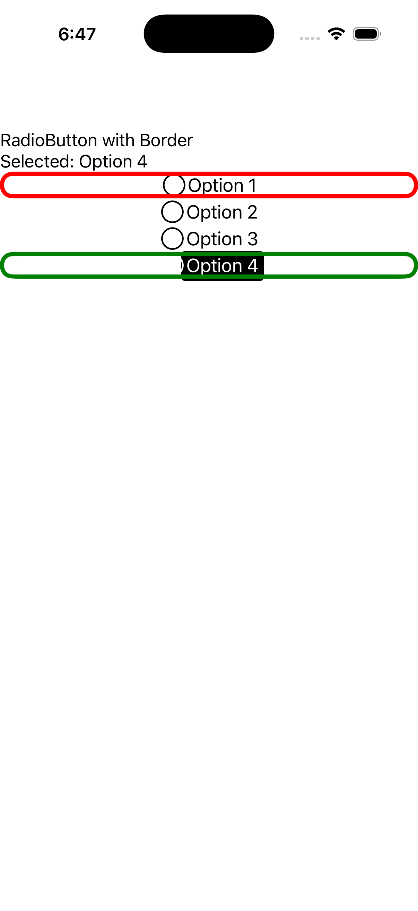
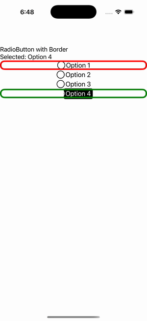

# RadioButton Border

Ports .NET MAUI's `RadioButtonBorder` ([oracle](../../../../../src/Controls/samples/Controls.Sample/Pages/Controls/RadioButtonGalleries/RadioButtonBorder.xaml)) as a code-first `maui::samples::radio_button_border_page`. Four RadioButtons exercising BorderColor / BorderWidth / CornerRadius + BackgroundColor (mapping to the port's stroke_color / stroke_thickness / corner_radius), auto-grouped by shared parent (one-checked-per-group) with a selection readout.

| macOS (AppKit) | iOS (UIKit) |
| --- | --- |
|  |  |

**Running on iOS:**

**Platforms:** macOS ✅ demo · iOS ✅ demo · Windows ⬜ TODO · Linux ⬜ TODO · Android ⬜ TODO

**Run it:** `MAUI_SAMPLE_PAGE=radio_button_border ./build/apple/maui_macos_gallery` (macOS) · `SIMCTL_CHILD_MAUI_SAMPLE_PAGE=radio_button_border xcrun simctl launch booted dev.maui-cpp.ios-gallery` (iOS)

> Natively-rendered Border demo — the `border` control draws its StrokeShape (a `shapes::*` geometry) + stroke + content through the handler on both Apple backends.
