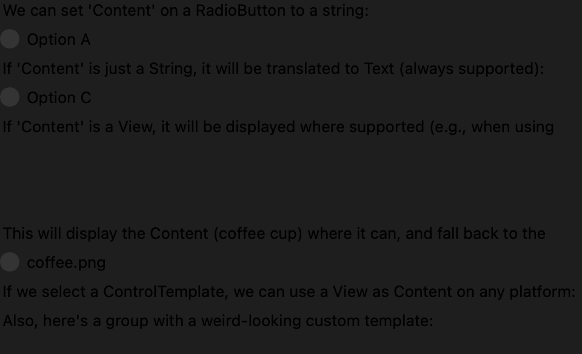
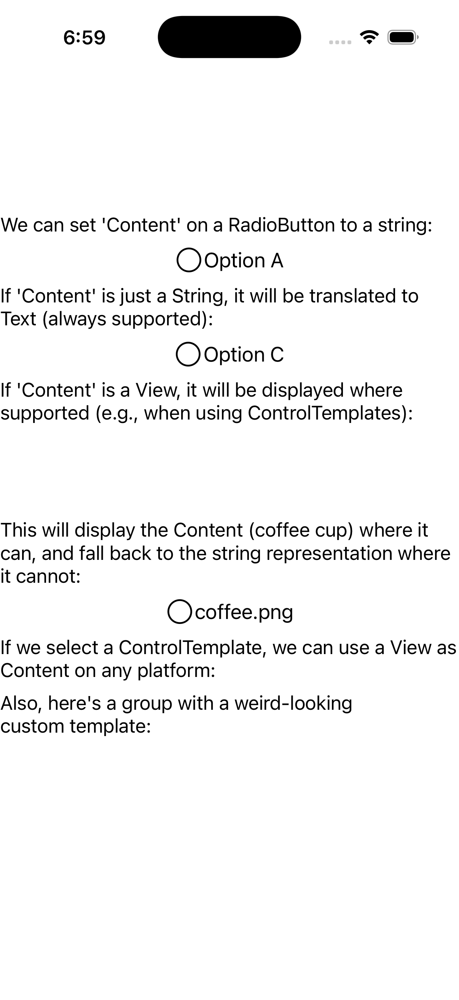
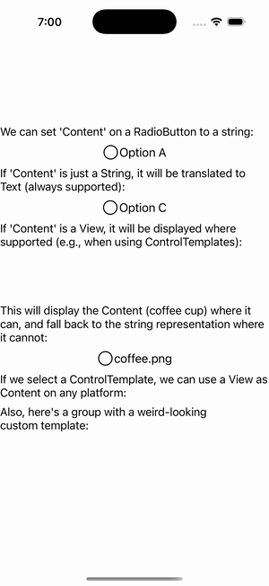

# RadioButton Content

Ports .NET MAUI's `RadioButtonContentGallery` ([oracle](../../../../../src/Controls/samples/Controls.Sample/Pages/Controls/RadioButtonGalleries/RadioButtonContentGallery.xaml)) as a code-first `maui::samples::radio_button_content_page`. RadioButton string Content (the native string path) + View-as-Content via a ControlTemplate. *Note:* radio_button View-Content + the default template are documented-deferred, so the View-as-Content path is shown on the `content_view`/`content_presenter` seam (the exact machinery C# radio templates rely on) — not invented.

| macOS (AppKit) | iOS (UIKit) |
| --- | --- |
|  |  |

**Running on iOS:**

**Platforms:** macOS ✅ demo · iOS ✅ demo · Windows ⬜ TODO · Linux ⬜ TODO · Android ⬜ TODO

**Run it:** `MAUI_SAMPLE_PAGE=radio_button_content ./examples/build/gallery/gallery` (macOS) · `SIMCTL_CHILD_MAUI_SAMPLE_PAGE=radio_button_content xcrun simctl launch booted dev.maui-cpp.ios-gallery` (iOS)
