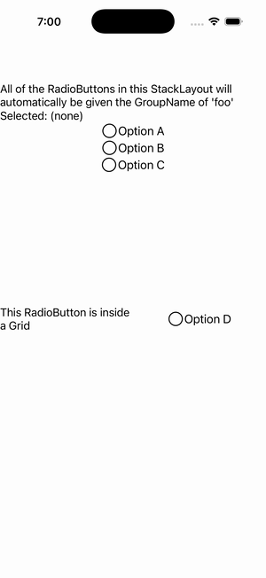

# RadioButton Group (container GroupName)

Ports .NET MAUI's `RadioButtonGroupGallery` ([oracle](../../../../../src/Controls/samples/Controls.Sample/Pages/Controls/RadioButtonGalleries/RadioButtonGroupGallery.xaml)) as a code-first `maui::samples::radio_button_group_page`. Container-attached `RadioButtonGroup.GroupName` on a StackLayout auto-grouping all descendant radios (including one nested in a Grid) into one mutually-exclusive group, with a live selection readout via the controller's `selected_value_changed`.

| macOS (AppKit) | iOS (UIKit) |
| --- | --- |
|  |  |

**Running on iOS:**

**Platforms:** macOS ✅ demo · iOS ✅ demo · Windows ⬜ TODO · Linux ⬜ TODO · Android ⬜ TODO

**Run it:** `MAUI_SAMPLE_PAGE=radio_button_group ./build/apple/maui_macos_gallery` (macOS) · `SIMCTL_CHILD_MAUI_SAMPLE_PAGE=radio_button_group xcrun simctl launch booted dev.maui-cpp.ios-gallery` (iOS)
