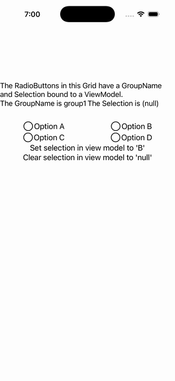

# RadioButton Group Binding

Ports .NET MAUI's `RadioButtonGroupBindingGallery` ([oracle](../../../../../src/Controls/samples/Controls.Sample/Pages/Controls/RadioButtonGalleries/RadioButtonGroupBindingGallery.xaml)) as a code-first `maui::samples::radio_button_group_binding_page`. `GroupName` + two-way `SelectedValue` 'bound' to a view-model: Set/Clear buttons write VM→group (`set_selected_value("B")`/null, checking/unchecking the matching radio), and `selected_value_changed` writes group→VM into a StringFormat readout (TargetNullValue '(null)'). Both binding legs run through the controller seam (no XAML binding engine in the headless API).

| macOS (AppKit) | iOS (UIKit) |
| --- | --- |
|  |  |

**Running on iOS:**

**Platforms:** macOS ✅ demo · iOS ✅ demo · Windows ⬜ TODO · Linux ⬜ TODO · Android ⬜ TODO

**Run it:** `MAUI_SAMPLE_PAGE=radio_button_group_binding ./build/apple/maui_macos_gallery` (macOS) · `SIMCTL_CHILD_MAUI_SAMPLE_PAGE=radio_button_group_binding xcrun simctl launch booted dev.maui-cpp.ios-gallery` (iOS)
