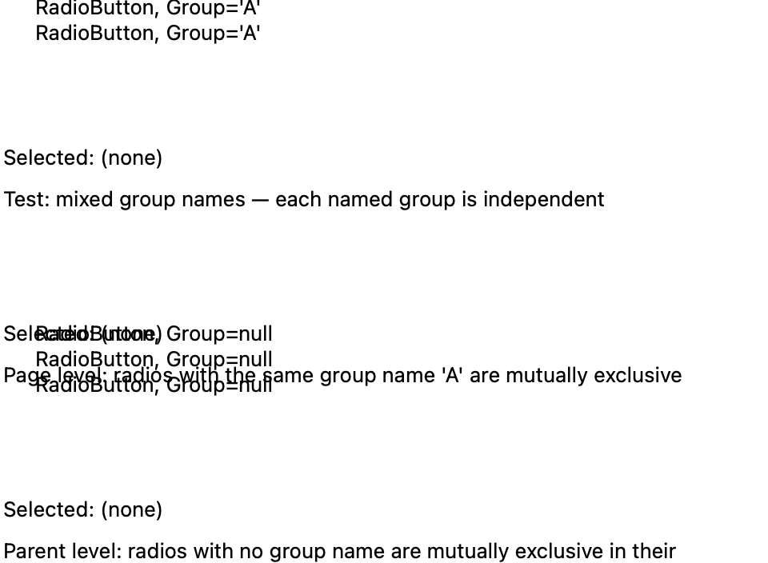
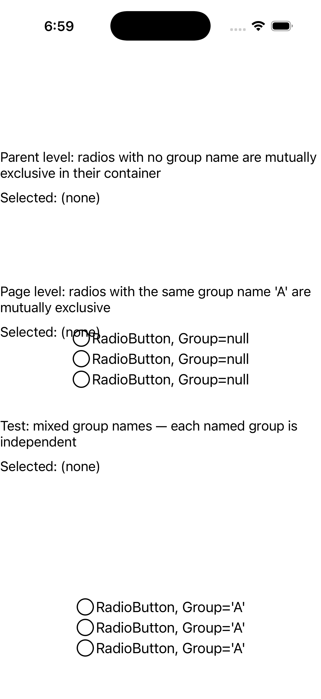
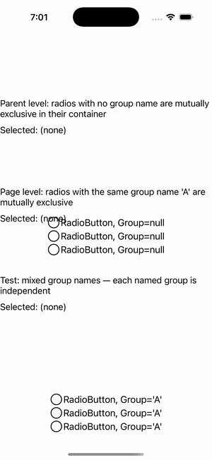

# RadioButton Group Scopes

Ports .NET MAUI's `RadioButtonGroupGalleryPage` ([oracle](../../../../../src/Controls/samples/Controls.Sample/Pages/Controls/RadioButtonGalleries/RadioButtonGroupGalleryPage.xaml)) as a code-first `maui::samples::radio_button_group_gallery_page`. The three grouping-scope scenarios as three stack sections — Parent level (no group name → auto-group by container), Page level (shared group), and Test (mixed groups A/B/C/null) — each via `radio_button_group::set_group_name` + `controller_of`, with per-section selection readouts.

| macOS (AppKit) | iOS (UIKit) |
| --- | --- |
|  |  |

**Running on iOS:**

**Platforms:** macOS ✅ demo · iOS ✅ demo · Windows ⬜ TODO · Linux ⬜ TODO · Android ⬜ TODO

**Run it:** `MAUI_SAMPLE_PAGE=radio_button_group_gallery ./examples/build/gallery/gallery` (macOS) · `SIMCTL_CHILD_MAUI_SAMPLE_PAGE=radio_button_group_gallery xcrun simctl launch booted dev.maui-cpp.ios-gallery` (iOS)
