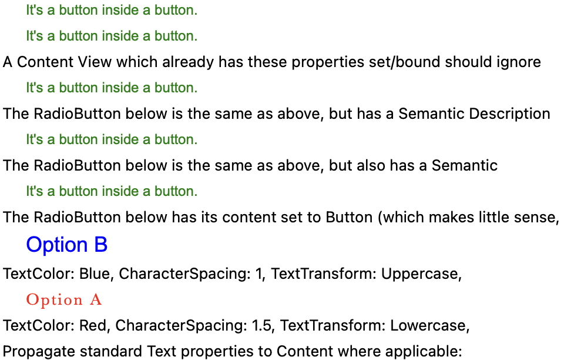
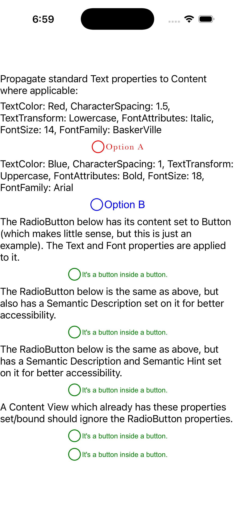
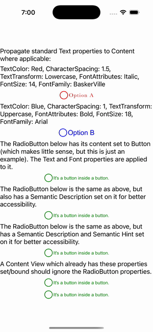

# RadioButton Content Properties

Ports .NET MAUI's `ContentProperties` ([oracle](../../../../../src/Controls/samples/Controls.Sample/Pages/Controls/RadioButtonGalleries/ContentProperties.xaml)) as a code-first `maui::samples::radio_content_properties_page`. Propagation of TextColor / CharacterSpacing / FontAttributes / FontSize / FontFamily to RadioButton string Content — Option A (Red/Italic/14/Baskerville/spacing 1.5), Option B (Blue/Bold/18/Arial), and lower radios (Green/Bold/12) — each radio's circle + content text rendered in its color (visible in the captures).

| macOS (AppKit) | iOS (UIKit) |
| --- | --- |
|  |  |

**Running on iOS:**

**Platforms:** macOS ✅ demo · iOS ✅ demo · Windows ⬜ TODO · Linux ⬜ TODO · Android ⬜ TODO

**Run it:** `MAUI_SAMPLE_PAGE=radio_content_properties ./examples/build/gallery/gallery` (macOS) · `SIMCTL_CHILD_MAUI_SAMPLE_PAGE=radio_content_properties xcrun simctl launch booted dev.maui-cpp.ios-gallery` (iOS)
