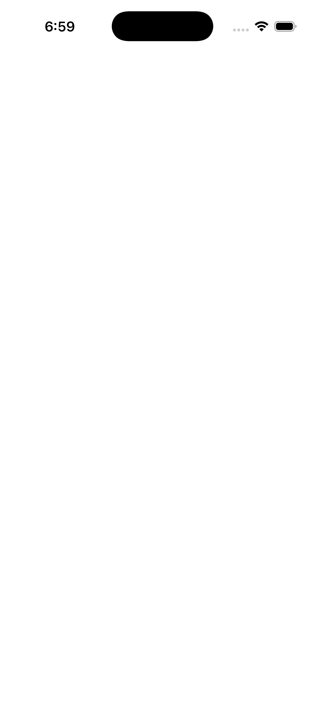

# RadioButton Template From Style

Ports .NET MAUI's `TemplateFromStyle` ([oracle](../../../../../src/Controls/samples/Controls.Sample/Pages/Controls/RadioButtonGalleries/TemplateFromStyle.xaml)) as a code-first `maui::samples::radio_template_from_style_page`. A CalendarRadioTemplate (a Border → Grid with a ring Ellipse + a check Ellipse + a content_presenter) shared across three grouped tiles. *Note:* the radio ControlTemplate + Style/Setter application are documented-deferred, so the template is hosted on the content_view/content_presenter seam.

| macOS (AppKit) | iOS (UIKit) |
| --- | --- |
|  |  |

**Running on iOS:**

**Platforms:** macOS ✅ demo · iOS ✅ demo · Windows ⬜ TODO · Linux ⬜ TODO · Android ⬜ TODO

**Run it:** `MAUI_SAMPLE_PAGE=radio_template_from_style ./build/apple/maui_macos_gallery` (macOS) · `SIMCTL_CHILD_MAUI_SAMPLE_PAGE=radio_template_from_style xcrun simctl launch booted dev.maui-cpp.ios-gallery` (iOS)
