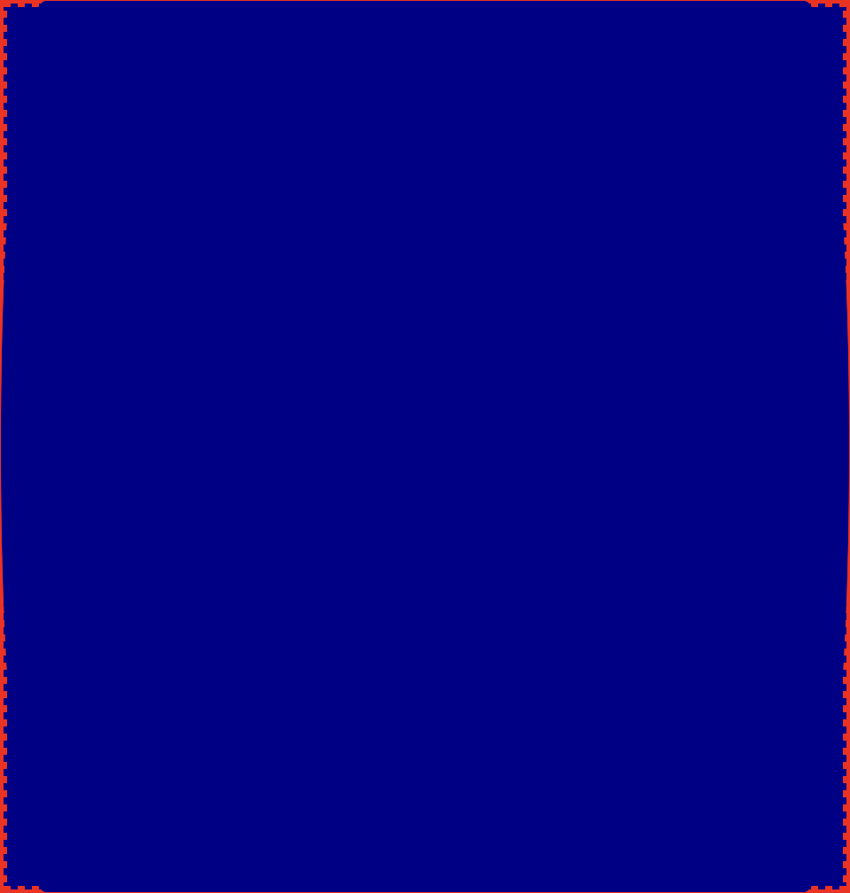
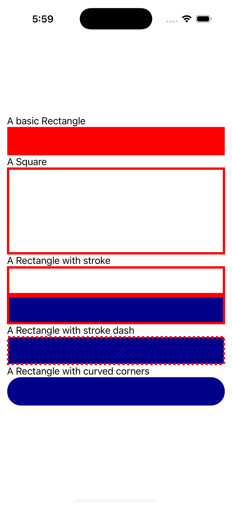
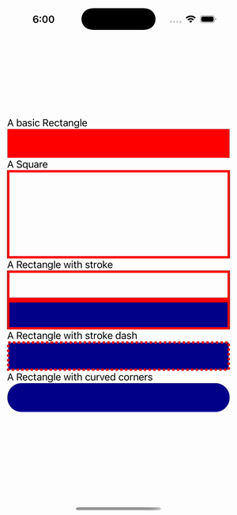

# Rectangle Gallery

Ports .NET MAUI's `RectangleGallery` ([oracle](../../../../../src/Controls/samples/Controls.Sample/Pages/Controls/ShapesGalleries/RectangleGallery.xaml)) as a code-first `maui::samples::rectangle_gallery_page`. Six rectangles including a curved-corner variant.

| macOS (AppKit) | iOS (UIKit) |
| --- | --- |
|  |  |

**Running on iOS:**

**Platforms:** macOS ✅ demo · iOS ✅ demo · Windows ⬜ TODO · Linux ⬜ TODO · Android ⬜ TODO

**Run it:** `MAUI_SAMPLE_PAGE=rectangle_gallery ./build/apple/maui_macos_gallery` (macOS) · `SIMCTL_CHILD_MAUI_SAMPLE_PAGE=rectangle_gallery xcrun simctl launch booted dev.maui-cpp.ios-gallery` (iOS)

> These are **natively-rendered** shape demos — the Shape control family (`controls::shapes::*`) draws through the graphics_view / shape_view handler over a CoreGraphics canvas, so the geometry is real pixels on both Apple backends (not a readout). Red-fill 150×50, a red-stroke(4) square, a red-stroke rect, a fill+stroke rect, a red-dashed rect, and a curved-corner rect (RadiusX 12 / RadiusY 24 — rendered with max()=24 per Rectangle.cs's documented single-radius GetPath, both radii still set).
