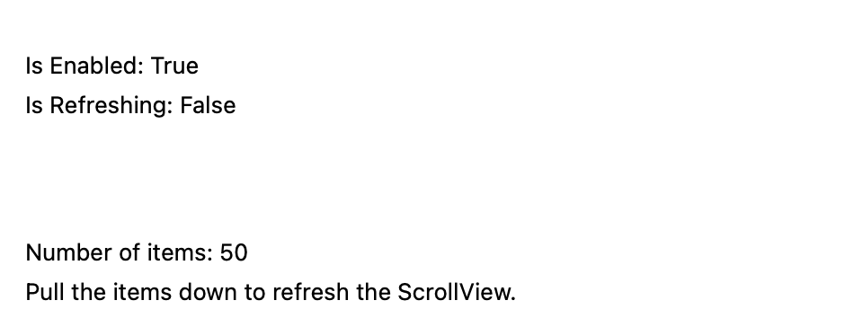
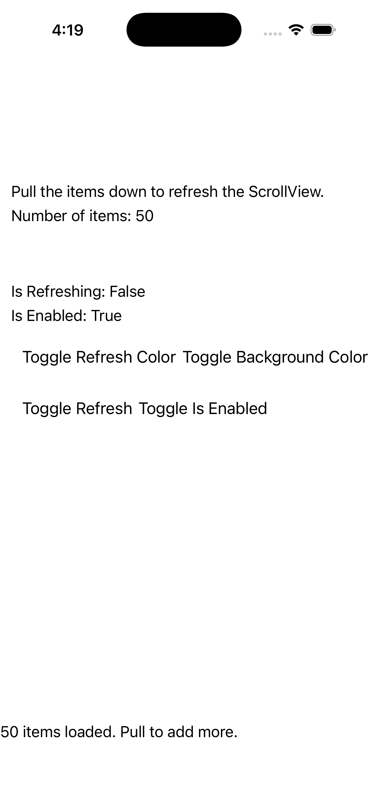
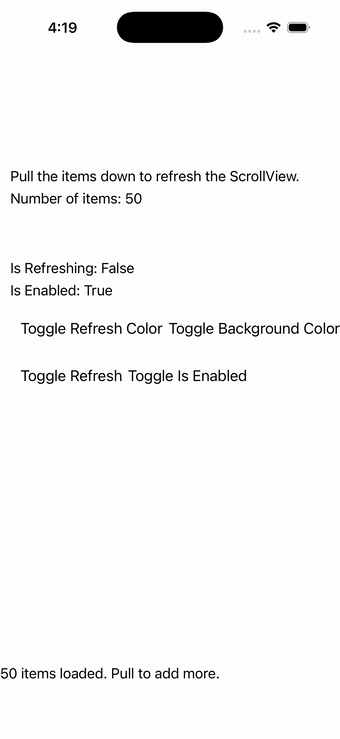

# RefreshView

Ports .NET MAUI's `RefreshViewPage` ([oracle](../../../../../src/Controls/samples/Controls.Sample/Pages/Controls/RefreshViewPage.xaml)) as a code-first `maui::samples::refresh_view_page`. RefreshView with a refresh Command (CanExecute = !IsRefreshing) that bumps an item count, plus Toggle Refresh (IsRefreshing), Toggle IsEnabled, Toggle Refresh Color (Teal↔Red), Toggle Background Color (Yellow↔Green), and live status labels.

| macOS (AppKit) | iOS (UIKit) |
| --- | --- |
|  |  |

**Running on iOS:**

**Platforms:** macOS ✅ demo · iOS ✅ demo · Windows ⬜ TODO · Linux ⬜ TODO · Android ⬜ TODO

**Run it:**
- macOS — `MAUI_SAMPLE_PAGE=refresh_view ./examples/build/gallery/gallery`
- iOS sim — `SIMCTL_CHILD_MAUI_SAMPLE_PAGE=refresh_view xcrun simctl launch booted dev.maui-cpp.ios-gallery`

> Notes: the C# 2s async refresh collapses to a synchronous AddItems + IsRefreshing=false (gallery convention); the BindableLayout color-box DataTemplate collapses to an item-count label.
