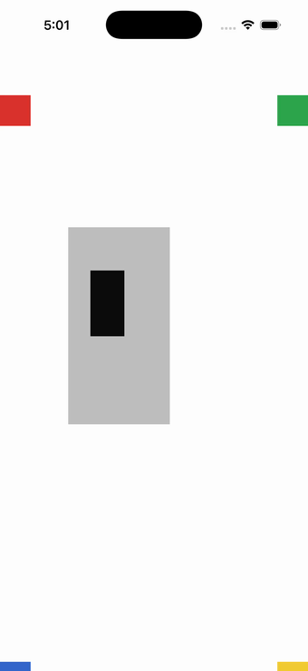

# RelativeLayout (approximated)

Ports .NET MAUI's `RelativeLayoutPage` ([oracle](../../../../../src/Controls/samples/Controls.Sample/Pages/Layouts/RelativeLayoutPage.xaml)) as a code-first `maui::samples::relative_layout_page`. The legacy Compatibility.RelativeLayout + ConstraintExpression scene reproduced with absolute_layout + proportional LayoutFlags (MAUI's recommended replacement): four corner boxes + a centered 1/3-size box.

| macOS (AppKit) | iOS (UIKit) |
| --- | --- |
|  |  |

**Running on iOS:**

**Platforms:** macOS ✅ demo · iOS ✅ demo · Windows ⬜ TODO · Linux ⬜ TODO · Android ⬜ TODO

**Run it:** `MAUI_SAMPLE_PAGE=relative_layout ./build/apple/maui_macos_gallery` (macOS) · `SIMCTL_CHILD_MAUI_SAMPLE_PAGE=relative_layout xcrun simctl launch booted dev.maui-cpp.ios-gallery` (iOS)

> Notes: RelativeLayout is **not ported** — the Compatibility namespace is out-of-scope, so there is no relative_layout to target (none was invented); approximated honestly with absolute_layout. The sibling-relative (RelativeToView) box has no absolute_layout analog and is approximated over the same region (noted inline).
