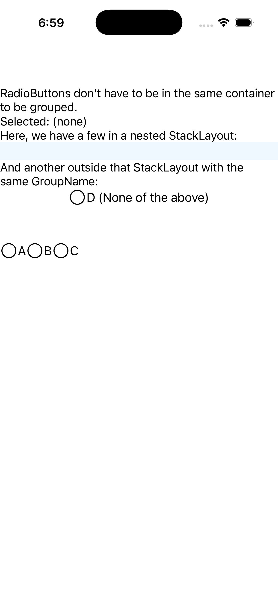

# Scattered RadioButtons

Ports .NET MAUI's `ScatteredRadioButtonGallery` ([oracle](../../../../../src/Controls/samples/Controls.Sample/Pages/Controls/RadioButtonGalleries/ScatteredRadioButtonGallery.xaml)) as a code-first `maui::samples::scattered_radio_button_page`. Cross-container GroupName grouping — radios in a nested stack grouped via container-attached `GroupName`, plus one radio OUTSIDE that stack joining the same group via its own `set_group_name` — all four mutually exclude. Exercises both the container-attached and per-button GroupName channels.

| macOS (AppKit) | iOS (UIKit) |
| --- | --- |
|  |  |

**Running on iOS:**

**Platforms:** macOS ✅ demo · iOS ✅ demo · Windows ⬜ TODO · Linux ⬜ TODO · Android ⬜ TODO

**Run it:** `MAUI_SAMPLE_PAGE=scattered_radio_button ./examples/build/gallery/gallery` (macOS) · `SIMCTL_CHILD_MAUI_SAMPLE_PAGE=scattered_radio_button xcrun simctl launch booted dev.maui-cpp.ios-gallery` (iOS)
