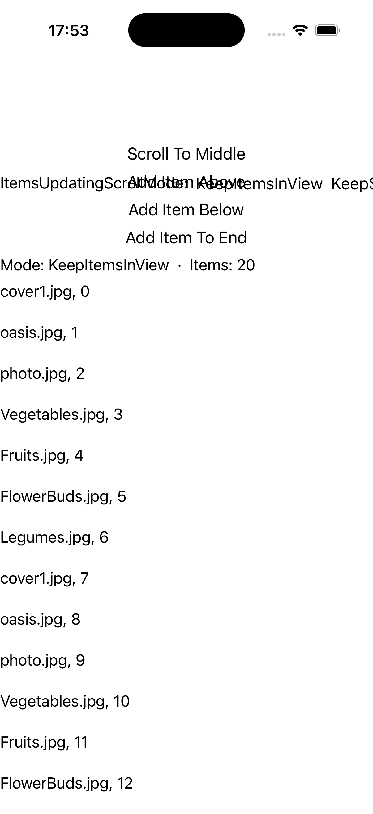
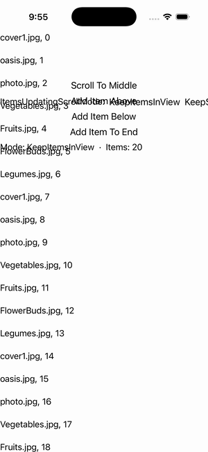

# CollectionView — Scroll Mode Test

Ports .NET MAUI's `ScrollModeTestGallery` ([oracle](../../../../../src/Controls/samples/Controls.Sample/Pages/Controls/CollectionViewGalleries/ScrollModeTestGallery.xaml)) as a code-first `maui::samples::scroll_mode_test_page`. Scroll behaviors — Scroll To Middle (`scroll_to(count/2, Start)`), Add Item Above/Below/End (insert at computed indices), with the ScrollTo observed via `scroll_to_requested` and three buttons setting the active ItemsUpdatingScrollMode so inserts interact with it.

| macOS (AppKit) | iOS (UIKit) |
| --- | --- |
|  |  |

**Running on iOS:**

**Platforms:** macOS ✅ demo · iOS ✅ demo · Windows ⬜ TODO · Linux ⬜ TODO · Android ⬜ TODO

**Run it:** `MAUI_SAMPLE_PAGE=scroll_mode_test ./examples/build/gallery/gallery` (macOS) · `SIMCTL_CHILD_MAUI_SAMPLE_PAGE=scroll_mode_test xcrun simctl launch booted dev.maui-cpp.ios-gallery` (iOS)
