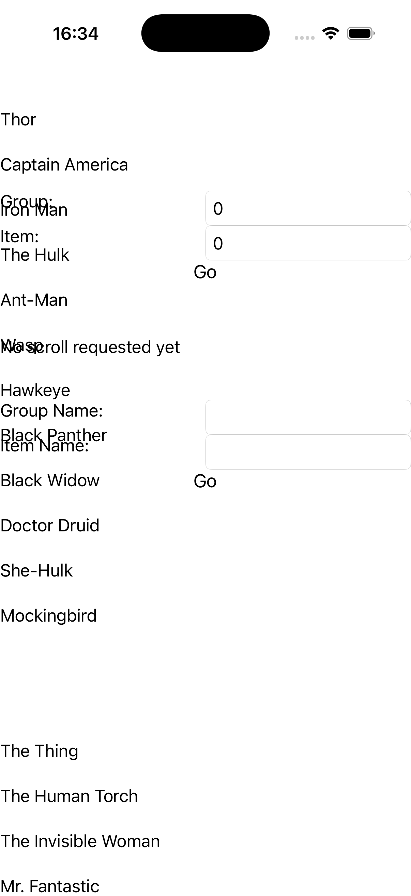

# CollectionView — Scroll To Group

Ports .NET MAUI's `ScrollToGroup` ([oracle](../../../../../src/Controls/samples/Controls.Sample/Pages/Controls/CollectionViewGalleries/ScrollToGalleries/ScrollToGroup.xaml)) as a code-first `maui::samples::scroll_to_group_page`. A grouped CollectionView (six SuperTeams) with a 'Go' button calling `scroll_to(itemIndex, groupIndex)` (position overload) and a second calling `scroll_to(member, team)` (element overload), with a `scroll_to_requested` readout of the target.

| macOS (AppKit) | iOS (UIKit) |
| --- | --- |
|  |  |

**Running on iOS:**

**Platforms:** macOS ✅ demo · iOS ✅ demo · Windows ⬜ TODO · Linux ⬜ TODO · Android ⬜ TODO

**Run it:** `MAUI_SAMPLE_PAGE=scroll_to_group ./examples/build/gallery/gallery` (macOS) · `SIMCTL_CHILD_MAUI_SAMPLE_PAGE=scroll_to_group xcrun simctl launch booted dev.maui-cpp.ios-gallery` (iOS)

> Struct-typed item cells render their template-bound content natively (post the TemplatedCell.Bind fix).
