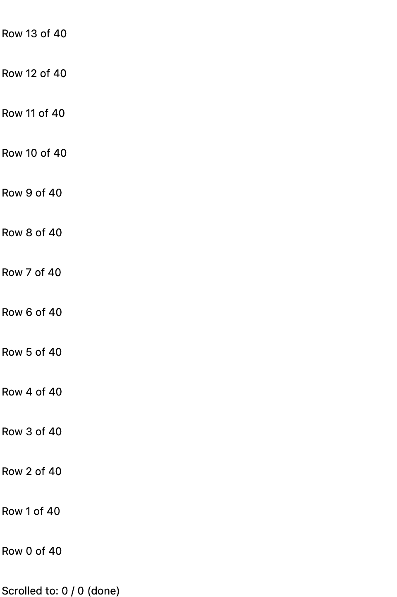
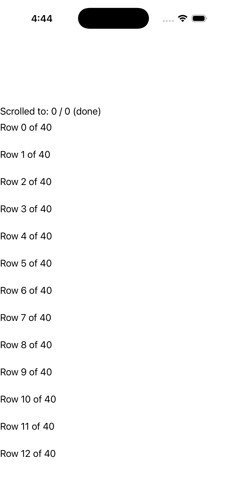

# ScrollView

Ports .NET MAUI's `ScrollViewPage` ([oracle](../../../../../src/Controls/samples/Controls.Sample/Pages/Layouts/ScrollViewPage.xaml)) as a code-first `maui::samples::scroll_view_page`. A vertical `scroll_view` over tall content (40 rows + end label) with the Scrolled event echoed to a readout, ScrollToCompleted, and a constructor-time ScrollToAsync that flushes once the handler attaches.

| macOS (AppKit) | iOS (UIKit) |
| --- | --- |
|  |  |

**Running on iOS:**

**Platforms:** macOS ✅ demo · iOS ✅ demo · Windows ⬜ TODO · Linux ⬜ TODO · Android ⬜ TODO

**Run it:**
- macOS — `MAUI_SAMPLE_PAGE=scroll_view ./build/apple/maui_macos_gallery`
- iOS sim — `SIMCTL_CHILD_MAUI_SAMPLE_PAGE=scroll_view xcrun simctl launch booted dev.maui-cpp.ios-gallery`

> On macOS the gallery host sizes the window to the measured content over plain (unflipped) NSViews, so
> layout pages can show a partial/single block — the iOS capture is the faithful top-down layout. Notes: distilled from the four ScrollViewPages sub-demos (the page itself is a link list).
