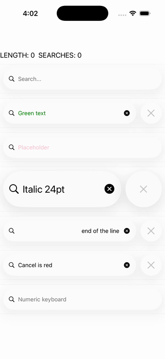

# SearchBar

Ports .NET MAUI's `SearchBarPage` ([oracle](../../../../../src/Controls/samples/Controls.Sample/Pages/Controls/SearchBarPage.xaml)) as a code-first `maui::samples::search_bar_page`. A search bar whose text drives a length/searches readout; the Search action runs a command then raises the search-button-pressed event (echoing the query); plus TextColor, Placeholder, italic font, alignment, CancelButtonColor and Keyboard rows.

| macOS (AppKit) | iOS (UIKit) |
| --- | --- |
|  |  |

**Running on iOS:**

**Platforms:** macOS ✅ demo · iOS ✅ demo · Windows ⬜ TODO · Linux ⬜ TODO · Android ⬜ TODO

**Run it:**
- macOS — `MAUI_SAMPLE_PAGE=search_bar ./build/apple/maui_macos_gallery`
- iOS sim — `SIMCTL_CHILD_MAUI_SAMPLE_PAGE=search_bar xcrun simctl launch booted dev.maui-cpp.ios-gallery`

> Notes: SearchCommand/SearchCommandParameter is collapsed onto the port's command+event channel; background sections + Focus/Unfocus are out of scope.
