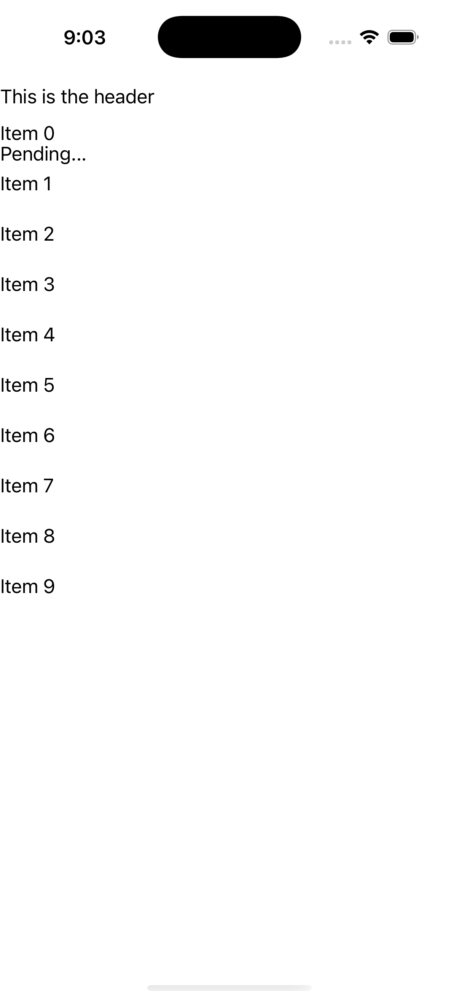

# CollectionView — Selection Command Parameter

Ports .NET MAUI's `SelectionChangedCommandParameter` ([oracle](../../../../../src/Controls/samples/Controls.Sample/Pages/Controls/CollectionViewGalleries/SelectionGalleries/SelectionChangedCommandParameter.xaml)) as a code-first `maui::samples::selection_command_param_page`. SelectionMode=Single with a `selection_changed_command` writing Success/Fail into a Result label, verifying the CommandParameter==SelectedItem equivalence (the headless command is parameterless, so the parameter semantics are realized by reading `selected_item()` in the command body).

| macOS (AppKit) | iOS (UIKit) |
| --- | --- |
|  |  |

**Running on iOS:**

**Platforms:** macOS ✅ demo · iOS ✅ demo · Windows ⬜ TODO · Linux ⬜ TODO · Android ⬜ TODO

**Run it:** `MAUI_SAMPLE_PAGE=selection_command_param ./examples/build/gallery/gallery` (macOS) · `SIMCTL_CHILD_MAUI_SAMPLE_PAGE=selection_command_param xcrun simctl launch booted dev.maui-cpp.ios-gallery` (iOS)

> Struct-typed item cells render their template-bound content natively (post the TemplatedCell.Bind fix).
