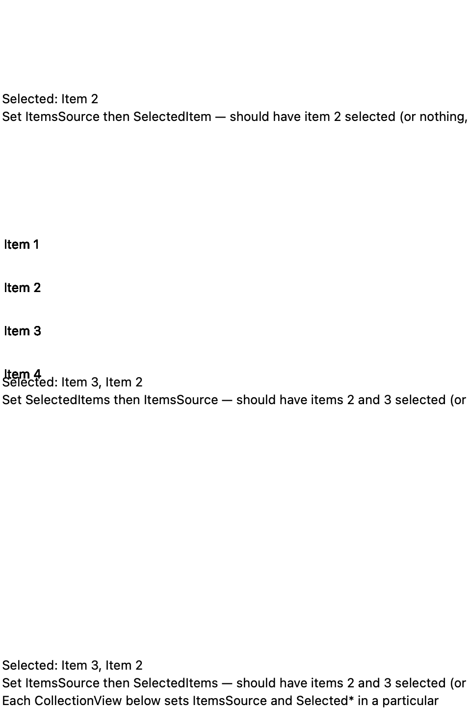
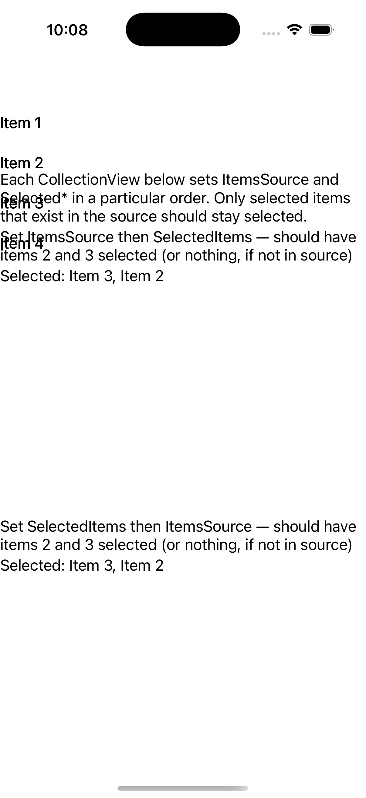

# CollectionView — Selection Synchronization

Ports .NET MAUI's `SelectionSynchronization` ([oracle](../../../../../src/Controls/samples/Controls.Sample/Pages/Controls/CollectionViewGalleries/SelectionGalleries/SelectionSynchronization.xaml)) as a code-first `maui::samples::selection_synchronization_page`. Nine CollectionViews testing ItemsSource-vs-Selected* set order across Single/Multiple + in-source/not-in-source seeds, plus a Switch Source button swapping to a partial-overlap source so only the still-present item survives selection; each CV reports its live selection. Not-in-source selections coerce away (in either set order).

| macOS (AppKit) | iOS (UIKit) |
| --- | --- |
|  |  |

**Running on iOS:**

**Platforms:** macOS ✅ demo · iOS ✅ demo · Windows ⬜ TODO · Linux ⬜ TODO · Android ⬜ TODO

**Run it:** `MAUI_SAMPLE_PAGE=selection_synchronization ./build/apple/maui_macos_gallery` (macOS) · `SIMCTL_CHILD_MAUI_SAMPLE_PAGE=selection_synchronization xcrun simctl launch booted dev.maui-cpp.ios-gallery` (iOS)
