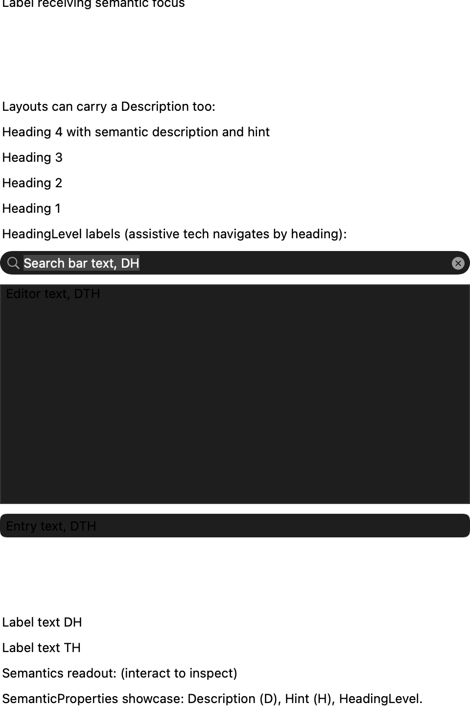
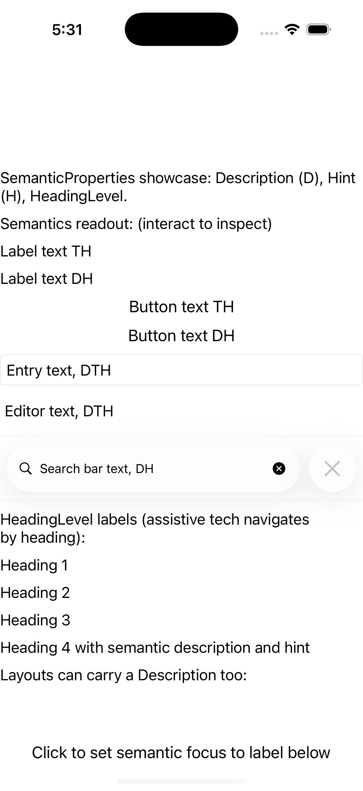
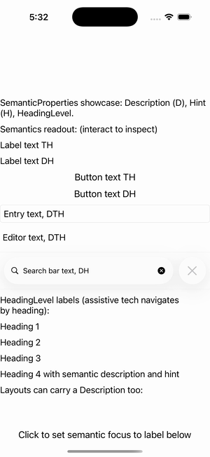

# Semantics (Accessibility)

Ports .NET MAUI's `SemanticsPage` ([oracle](../../../../../src/Controls/samples/Controls.Sample/Pages/Core/SemanticsPage.xaml)) as a code-first `maui::samples::semantics_page`. SemanticProperties Description/Hint/HeadingLevel across a representative control subset.

| macOS (AppKit) | iOS (UIKit) |
| --- | --- |
|  |  |

**Running on iOS:**

**Platforms:** macOS ✅ demo · iOS ✅ demo · Windows ⬜ TODO · Linux ⬜ TODO · Android ⬜ TODO

**Run it:** `MAUI_SAMPLE_PAGE=semantics ./build/apple/maui_macos_gallery` (macOS) · `SIMCTL_CHILD_MAUI_SAMPLE_PAGE=semantics xcrun simctl launch booted dev.maui-cpp.ios-gallery` (iOS)

> Description/Hint on labels/buttons/entry/editor/search-bar, HeadingLevel 1–4 on labels, layout-level Description on a nested stack, all via `view::set_semantics(shared_ptr<core::semantics>)`, with an inspector readout echoing each control's D/H/heading-level. Ports a faithful subset (the C# page repeats the same pattern across ~30 controls); `SetSemanticFocus()` is a deferred native-a11y call, so the focus button echoes the target's semantics as the stand-in.
