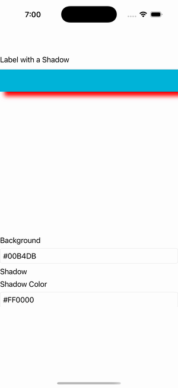

# Shadow Playground

Ports .NET MAUI's `ShadowPlaygroundPage` ([oracle](../../../../../src/Controls/samples/Controls.Sample/Pages/Core/ShadowGalleries/ShadowPlaygroundPage.xaml)) as a code-first `maui::samples::shadow_playground_page`. Fill-color + shadow-color entries and X/Y-offset / radius / opacity sliders driving a label's and box_view's `Shadow` (a fresh `maui::core::shadow` rebuilt per change so `set_shadow` re-fires `map_shadow`), with per-slider readouts and a 'Remove Shadow' button (`set_shadow(nullptr)`).

| macOS (AppKit) | iOS (UIKit) |
| --- | --- |
|  |  |

**Running on iOS:**

**Platforms:** macOS ✅ demo · iOS ✅ demo · Windows ⬜ TODO · Linux ⬜ TODO · Android ⬜ TODO

**Run it:** `MAUI_SAMPLE_PAGE=shadow_playground ./build/apple/maui_macos_gallery` (macOS) · `SIMCTL_CHILD_MAUI_SAMPLE_PAGE=shadow_playground xcrun simctl launch booted dev.maui-cpp.ios-gallery` (iOS)
