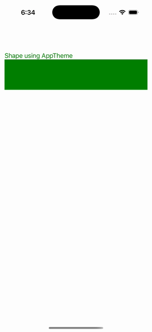

# Shape AppTheme

Ports .NET MAUI's `ShapeAppThemeGallery` ([oracle](../../../../../src/Controls/samples/Controls.Sample/Pages/Controls/ShapesGalleries/ShapeAppThemeGallery.xaml)) as a code-first `maui::samples::shape_app_theme_page`. A Rectangle + caption themed via an AppThemeBinding applier (the C# `AppThemeBinding.GetValue` logic) — Fill/Stroke/TextColor go Green (light) / Red (dark) on White / Black — seeded from `requested_theme()` and re-applied on `requested_theme_changed`.

| macOS (AppKit) | iOS (UIKit) |
| --- | --- |
|  |  |

**Running on iOS:**

**Platforms:** macOS ✅ demo · iOS ✅ demo · Windows ⬜ TODO · Linux ⬜ TODO · Android ⬜ TODO

**Run it:** `MAUI_SAMPLE_PAGE=shape_app_theme ./build/apple/maui_macos_gallery` (macOS) · `SIMCTL_CHILD_MAUI_SAMPLE_PAGE=shape_app_theme xcrun simctl launch booted dev.maui-cpp.ios-gallery` (iOS)

> Natively-rendered shape demo — the Shape family draws through the graphics_view / shape_view handler over a CoreGraphics canvas.
