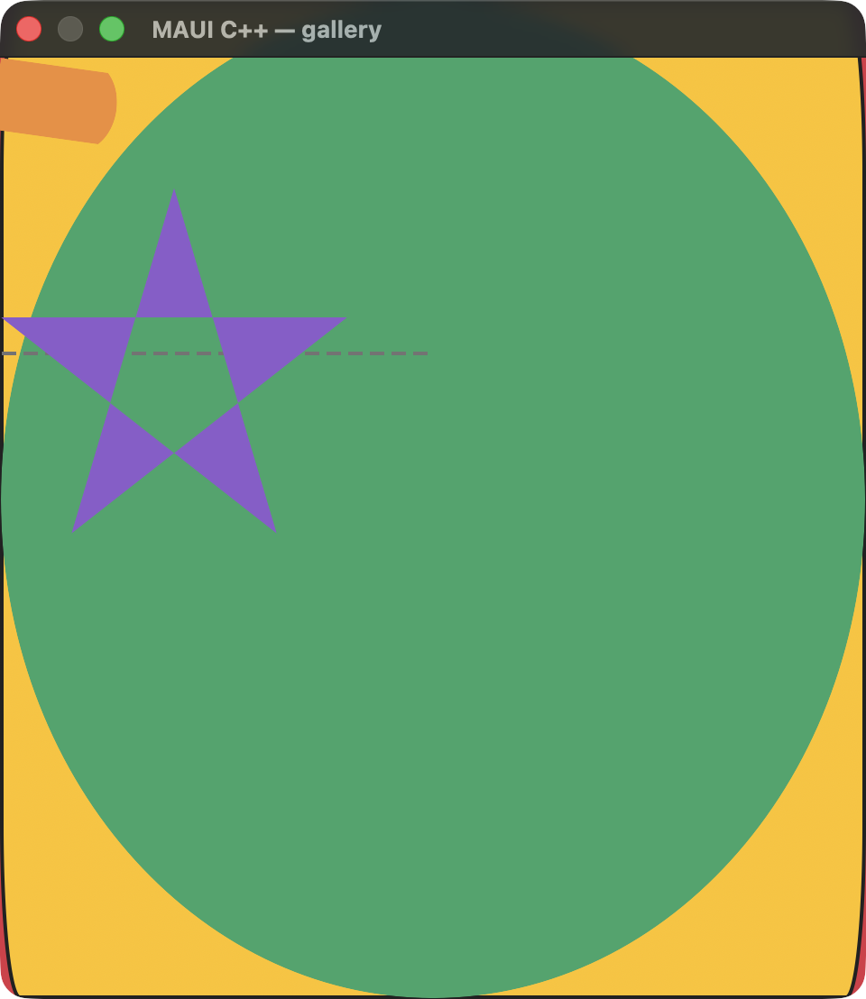
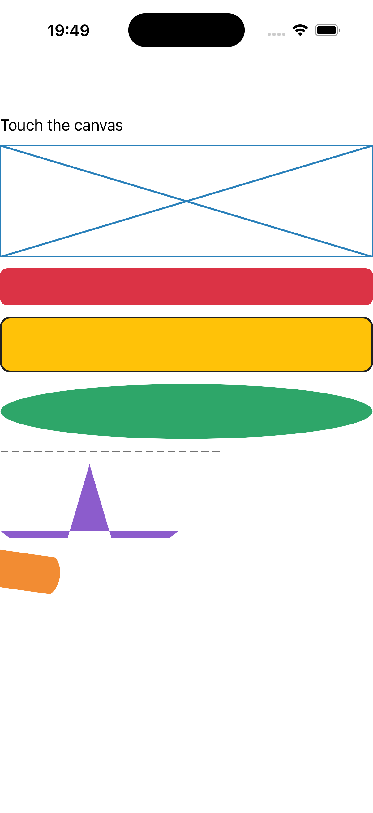

# Shapes & drawing

A `graphics_view` (a custom drawable painting through the canvas stack), a `box_view`, and the shape
family — rounded rectangle, ellipse, dashed line, star polygon (EvenOdd fill) and a rotated path.
Source: [`shapes_page.hpp`](../../../src/samples/pages/shapes_page.hpp).

| macOS (AppKit) | iOS (UIKit) |
| --- | --- |
|  |  |

**Running on iOS:**

**Native rendering exercised:** the shared CoreGraphics canvas (`coregraphics_canvas.mm`) for the
graphics view, plus `CAShapeLayer`-backed shape views — fills, strokes, dashes, EvenOdd winding and a
rotation transform.

**Platforms:** macOS ✅ demo · iOS ✅ demo · Windows ⬜ TODO · Linux ⬜ TODO · Android ⬜ TODO

**Run it:**
- macOS — `MAUI_SAMPLE_PAGE=shapes ./build/apple/maui_macos_gallery`
- iOS sim — `SIMCTL_CHILD_MAUI_SAMPLE_PAGE=shapes xcrun simctl launch booted dev.maui-cpp.ios-gallery`

> The iOS capture is the showcase — the graphics-view cross, red box, yellow stroked rounded-rect, green
> ellipse, dashed line, purple star and orange rotated path all render top-to-bottom. On macOS the same
> shapes render but overlap (AppKit unflipped-view layout deviation sizes the stack differently).
