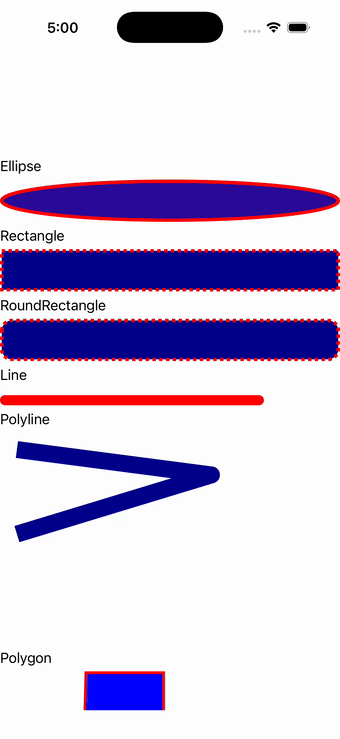

# Shapes (gallery)

Ports .NET MAUI's `ShapesPage` ([oracle](../../../../../src/Controls/samples/Controls.Sample/Pages/Controls/ShapesPage.xaml)) as a code-first `maui::samples::shapes_demo_page`. ScrollView walking Ellipse, Rectangle (dashed stroke), RoundRectangle, Line (round caps), Polyline (round join), Polygon (EvenOdd star), and a markup-geometry Path.

| macOS (AppKit) | iOS (UIKit) |
| --- | --- |
|  |  |

**Running on iOS:**

**Platforms:** macOS ✅ demo · iOS ✅ demo · Windows ⬜ TODO · Linux ⬜ TODO · Android ⬜ TODO

**Run it:** `MAUI_SAMPLE_PAGE=shapes_demo ./build/apple/maui_macos_gallery` (macOS) · `SIMCTL_CHILD_MAUI_SAMPLE_PAGE=shapes_demo xcrun simctl launch booted dev.maui-cpp.ios-gallery` (iOS)

> Notes: RoundRectangle is a Rectangle with RadiusX=RadiusY (C#'s own decomposition); the "More samples" sub-gallery drives a readout.
