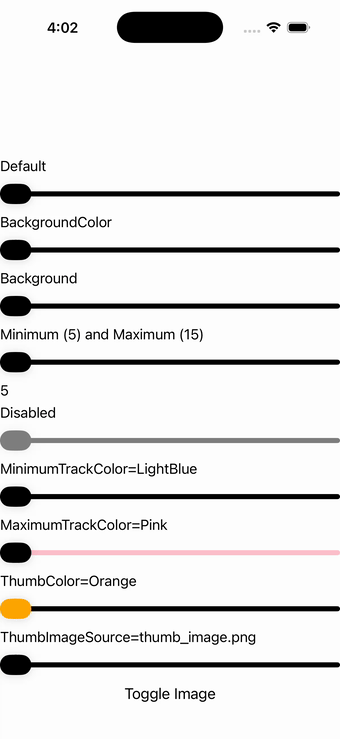

# Slider

Ports .NET MAUI's `SliderPage` ([oracle](../../../../../src/Controls/samples/Controls.Sample/Pages/Controls/SliderPage.xaml)) as a code-first `maui::samples::slider_page`. Default / BackgroundColor / Background-gradient / Min(5)Max(15) / Disabled / Minimum+Maximum track colors / ThumbColor / ThumbImageSource toggle / tri-color custom slider / a dynamic slider whose buttons set Minimum=4/Maximum=8 / and the Min==Max==Value edge case.

| macOS (AppKit) | iOS (UIKit) |
| --- | --- |
|  |  |

**Running on iOS:**

**Platforms:** macOS ✅ demo · iOS ✅ demo · Windows ⬜ TODO · Linux ⬜ TODO · Android ⬜ TODO

**Run it:**
- macOS — `MAUI_SAMPLE_PAGE=slider ./build/apple/maui_macos_gallery`
- iOS sim — `SIMCTL_CHILD_MAUI_SAMPLE_PAGE=slider xcrun simctl launch booted dev.maui-cpp.ios-gallery`

