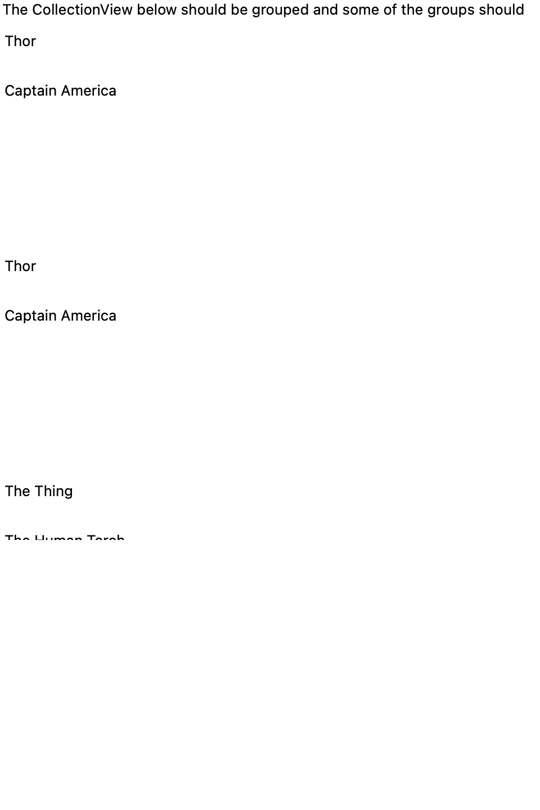
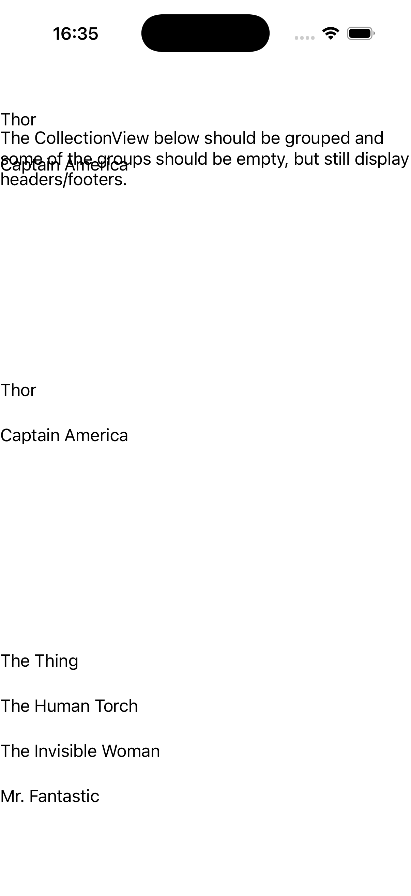
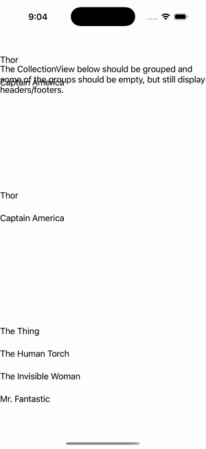

# CollectionView — Some Empty Groups

Ports .NET MAUI's `SomeEmptyGroups` ([oracle](../../../../../src/Controls/samples/Controls.Sample/Pages/Controls/CollectionViewGalleries/GroupingGalleries/SomeEmptyGroups.xaml)) as a code-first `maui::samples::some_empty_groups_page`. A grouped CollectionView where 2 of 5 groups (Thundercats, Bionic Six) have zero members — proving empty groups still render their group header + 'Total members: 0' footer (incl. the deliberate duplicate 'Avengers' group).

| macOS (AppKit) | iOS (UIKit) |
| --- | --- |
|  |  |

**Running on iOS:**

**Platforms:** macOS ✅ demo · iOS ✅ demo · Windows ⬜ TODO · Linux ⬜ TODO · Android ⬜ TODO

**Run it:** `MAUI_SAMPLE_PAGE=some_empty_groups ./examples/build/gallery/gallery` (macOS) · `SIMCTL_CHILD_MAUI_SAMPLE_PAGE=some_empty_groups xcrun simctl launch booted dev.maui-cpp.ios-gallery` (iOS)

> Struct-typed item cells render their template-bound content natively (post the TemplatedCell.Bind fix).
