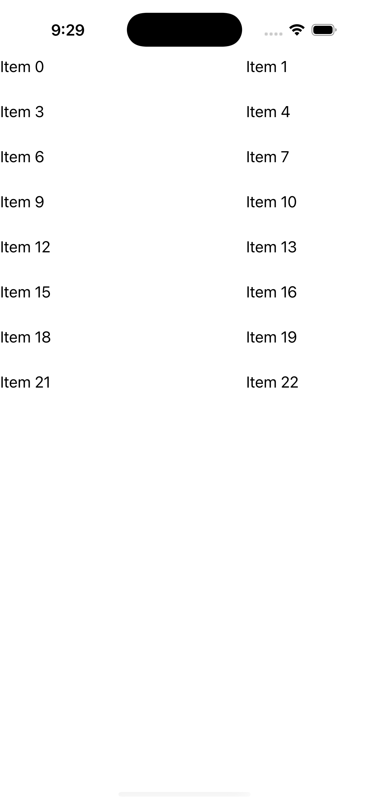
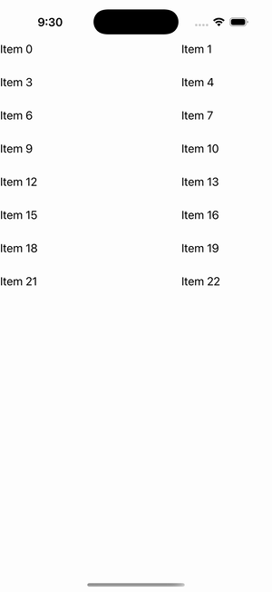

# CollectionView — Staggered Layout (approx)

Ports .NET MAUI's `StaggeredLayout` ([oracle](../../../../../src/Controls/samples/Controls.Sample/Pages/Controls/CollectionViewGalleries/AlternateLayoutGalleries/StaggeredLayout.xaml)) as a code-first `maui::samples::staggered_layout_page`. A CollectionView with a GridItemsLayout (Span 3) over varied-height captioned cells. **Note:** the C# page is entirely commented-out — StaggeredCollectionView/StaggeredGridItemsLayout were never shipped in MAUI — so this reproduces the sketched intent via the shipped GridItemsLayout (the comment's own fallback base) + a per-cell bound HeightRequest as the 'staggered' signal; a true masonry pack is not ported (nothing to derive it from).

| macOS (AppKit) | iOS (UIKit) |
| --- | --- |
|  |  |

**Running on iOS:**

**Platforms:** macOS ✅ demo · iOS ✅ demo · Windows ⬜ TODO · Linux ⬜ TODO · Android ⬜ TODO

**Run it:** `MAUI_SAMPLE_PAGE=staggered_layout ./examples/build/gallery/gallery` (macOS) · `SIMCTL_CHILD_MAUI_SAMPLE_PAGE=staggered_layout xcrun simctl launch booted dev.maui-cpp.ios-gallery` (iOS)

> Struct-typed item cells render their template-bound content natively (post the TemplatedCell.Bind fix).
