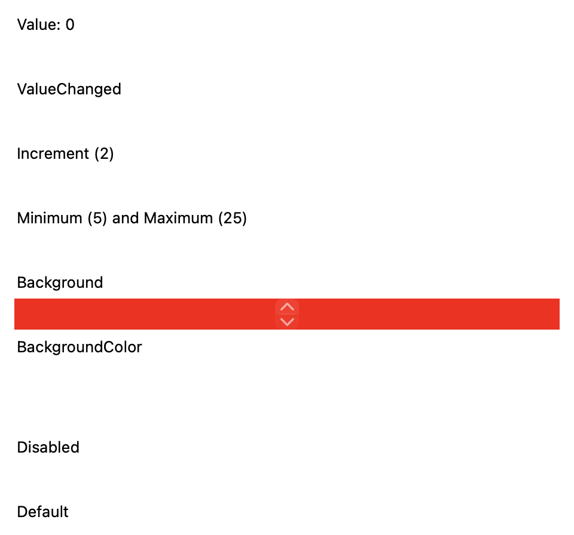
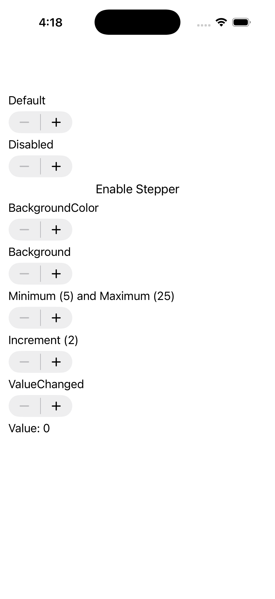
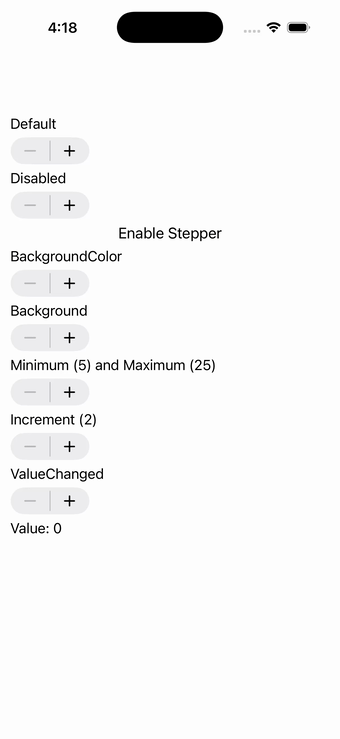

# Stepper

Ports .NET MAUI's `StepperPage` ([oracle](../../../../../src/Controls/samples/Controls.Sample/Pages/Controls/StepperPage.xaml)) as a code-first `maui::samples::stepper_page`. Default / disabled steppers with an Enable-Disable toggle, a Red BackgroundColor stepper, Minimum(5)/Maximum(25), Increment(2), and a ValueChanged stepper driving a live readout.

| macOS (AppKit) | iOS (UIKit) |
| --- | --- |
|  |  |

**Running on iOS:**

**Platforms:** macOS ✅ demo · iOS ✅ demo · Windows ⬜ TODO · Linux ⬜ TODO · Android ⬜ TODO

**Run it:**
- macOS — `MAUI_SAMPLE_PAGE=stepper ./build/apple/maui_macos_gallery`
- iOS sim — `SIMCTL_CHILD_MAUI_SAMPLE_PAGE=stepper xcrun simctl launch booted dev.maui-cpp.ios-gallery`

> Notes: the Background LinearGradientBrush stepper is left plain; section headers map to plain labels (no resource-dictionary styling surface).
