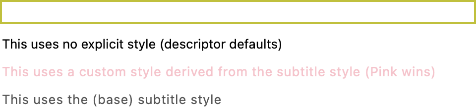
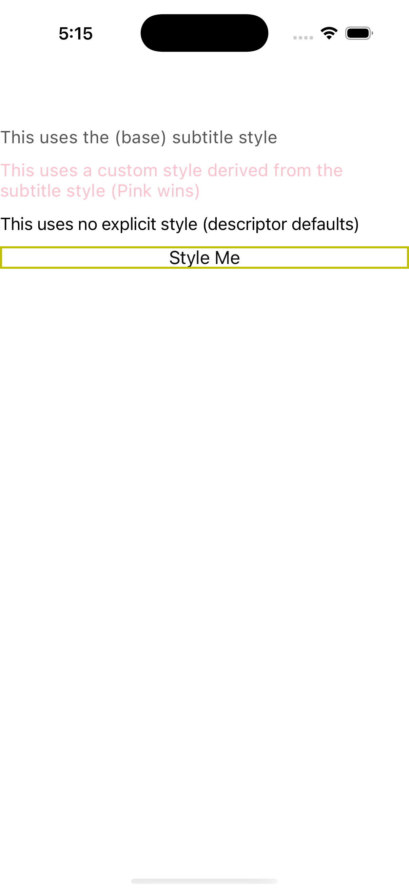
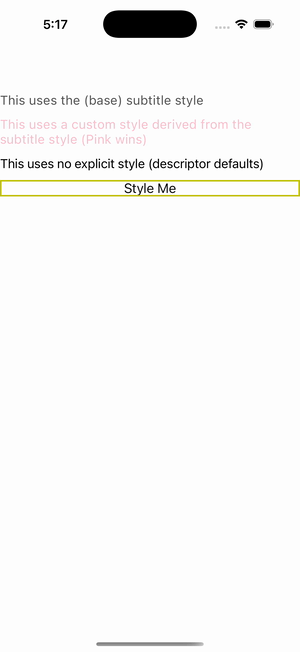

# Styles

Ports .NET MAUI's `StylesPage` ([oracle](../../../../../src/Controls/samples/Controls.Sample/Pages/UserInterface/StylesPage.xaml)) as a code-first `maui::samples::styles_page`. `style` setter bundles applied code-first, including `based_on` inheritance.

| macOS (AppKit) | iOS (UIKit) |
| --- | --- |
|  |  |

**Running on iOS:**

**Platforms:** macOS ✅ demo · iOS ✅ demo · Windows ⬜ TODO · Linux ⬜ TODO · Android ⬜ TODO

**Run it:** `MAUI_SAMPLE_PAGE=styles ./build/apple/maui_macos_gallery` (macOS) · `SIMCTL_CHILD_MAUI_SAMPLE_PAGE=styles xcrun simctl launch booted dev.maui-cpp.ios-gallery` (iOS)

> A base label style + a derived "custom" style via `based_on` proving the derived TextColor (Pink) wins over the base (ApplyCore's lowered base specificity), plus a multi-setter button style. C#'s BackgroundColor/HeightRequest/BoxView.Color setters use descriptors not exposed as `bindable_property<color>` on this surface, so the button style uses the button's own exposed descriptors (TextColor/CornerRadius/StrokeColor/StrokeThickness) — same mechanism, different chosen properties.
