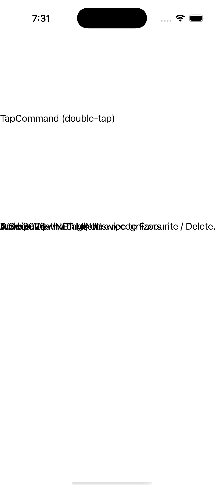
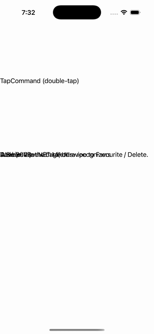

# SwipeView — Gesture Recognizer

Ports .NET MAUI's `SwipeViewGestureRecognizerGallery` ([oracle](../../../../../src/Controls/samples/Controls.Sample/Pages/Controls/SwipeViewGalleries/SwipeViewGestureRecognizerGallery.xaml)) as a code-first `maui::samples::swipe_gesture_page`. Gesture recognizers + swipe-item commands coexisting on one SwipeView — a double-tap TapGestureRecognizer (real `command`→"TapCommand"), a Favourite SwipeItem (`invoked`→"FavouriteCommand"), and a custom Delete swipe_item_view with its own tap recognizer (`command`→"DeleteCommand").

| macOS (AppKit) | iOS (UIKit) |
| --- | --- |
|  |  |

**Running on iOS:**

**Platforms:** macOS ✅ demo · iOS ✅ demo · Windows ⬜ TODO · Linux ⬜ TODO · Android ⬜ TODO

**Run it:** `MAUI_SAMPLE_PAGE=swipe_gesture ./examples/build/gallery/gallery` (macOS) · `SIMCTL_CHILD_MAUI_SAMPLE_PAGE=swipe_gesture xcrun simctl launch booted dev.maui-cpp.ios-gallery` (iOS)

> Note: SwipeView is gesture-driven (swipe-to-reveal). The swipe content + structure render, and each page synthetically calls `open()` so the SwipeItems are wired and their `invoked` fires into a readout; the revealed item panel may not visually offset in a static capture (it needs a live drag) — the swipe_view control, its item collections, and the invoked channel are what these prove.
