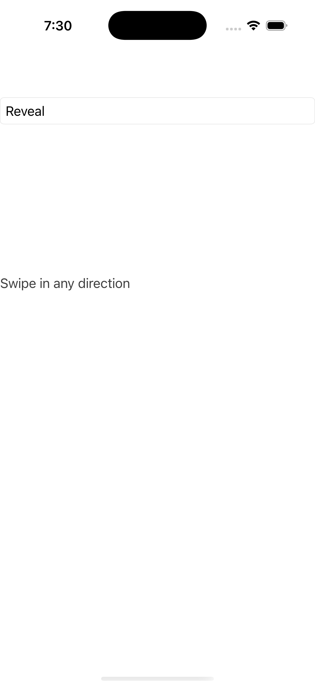
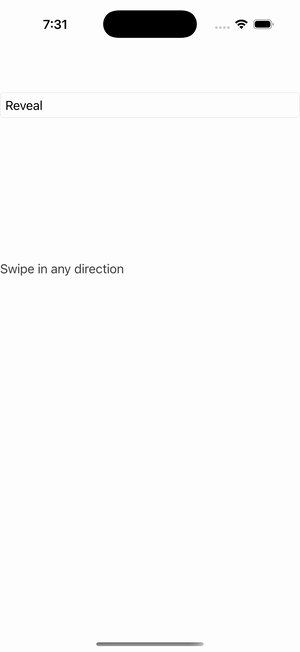

# SwipeView — Item Position

Ports .NET MAUI's `SwipeItemPositionGallery` ([oracle](../../../../../src/Controls/samples/Controls.Sample/Pages/Controls/SwipeViewGalleries/SwipeItemPositionGallery.xaml)) as a code-first `maui::samples::swipe_item_position_page`. A Reveal/Execute Picker over one SwipeView carrying two SwipeItems in each of the four directional collections (8 coloured items); the Picker fans the chosen SwipeMode onto all four collections (the exact C# OnModePickerSelectedIndexChanged).

| macOS (AppKit) | iOS (UIKit) |
| --- | --- |
|  |  |

**Running on iOS:**

**Platforms:** macOS ✅ demo · iOS ✅ demo · Windows ⬜ TODO · Linux ⬜ TODO · Android ⬜ TODO

**Run it:** `MAUI_SAMPLE_PAGE=swipe_item_position ./build/apple/maui_macos_gallery` (macOS) · `SIMCTL_CHILD_MAUI_SAMPLE_PAGE=swipe_item_position xcrun simctl launch booted dev.maui-cpp.ios-gallery` (iOS)

> Note: SwipeView is gesture-driven (swipe-to-reveal). The swipe content + structure render, and each page synthetically calls `open()` so the SwipeItems are wired and their `invoked` fires into a readout; the revealed item panel may not visually offset in a static capture (it needs a live drag) — the swipe_view control, its item collections, and the invoked channel are what these prove.
