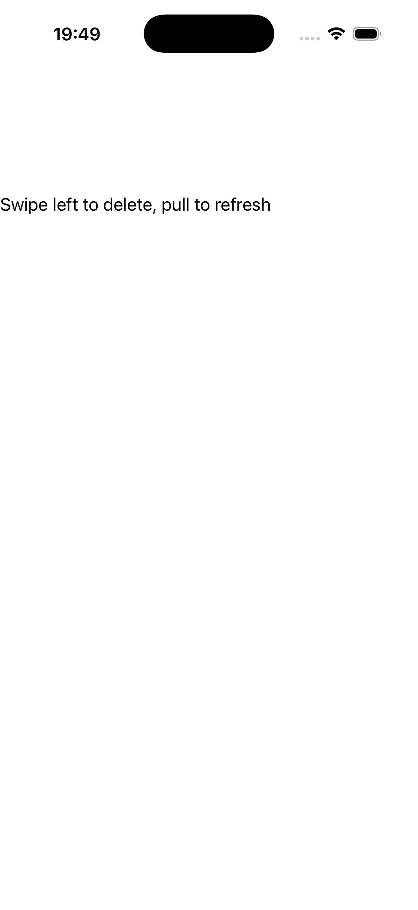

# Swipe & refresh

A `refresh_view` wrapping a `swipe_view` (which wraps a labelled row), with a readout reflecting the
latest interaction. Source: [`swipe_refresh_page.hpp`](../../../examples/gallery/pages/swipe_refresh_page.hpp).

| macOS (AppKit) | iOS (UIKit) |
| --- | --- |
|  |  |

**Running on iOS:**

**Native controls exercised:** `UIRefreshControl` (iOS) / programmatic refresh (AppKit deviation),
swipe-to-reveal `swipe_view` host, labelled row + readout.

**Platforms:** macOS ✅ demo · iOS ✅ demo · Windows ⬜ TODO · Linux ⬜ TODO · Android ⬜ TODO

**Run it:**
- macOS — `MAUI_SAMPLE_PAGE=swipe_refresh ./examples/build/gallery/gallery`
- iOS sim — `SIMCTL_CHILD_MAUI_SAMPLE_PAGE=swipe_refresh xcrun simctl launch booted dev.maui-cpp.ios-gallery`

> ⚠️ Partial in a static capture: the "Swipe left to delete, pull to refresh" header and the refresh /
> swipe hosts render, but the reveal + pull gestures are interaction-driven and don't show in a still
> screenshot — the value of this page is the live behaviour, not the at-rest view.
