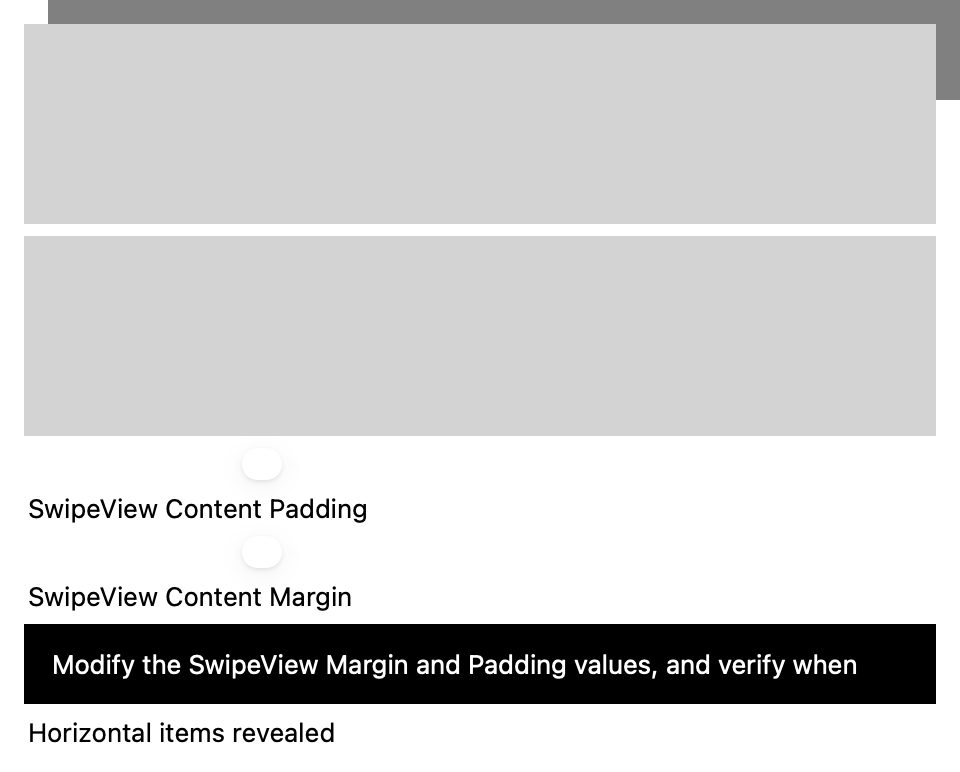
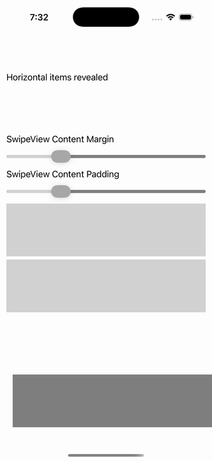

# SwipeView — Margin & Padding

Ports .NET MAUI's `SwipeViewMarginGallery` ([oracle](../../../../../src/Controls/samples/Controls.Sample/Pages/Controls/SwipeViewGalleries/SwipeViewMarginGallery.xaml)) as a code-first `maui::samples::swipe_view_margin_page`. Horizontal (Left/Right) + vertical (Top/Bottom) SwipeViews over gray grids, with Margin + Padding sliders (0–48). The PaddingSlider drives both grids' `set_padding` (the C# Padding {x:Reference} binding); Margin drives the readout (`view::margin()` is read-only at this layer — noted).

| macOS (AppKit) | iOS (UIKit) |
| --- | --- |
|  |  |

**Running on iOS:**

**Platforms:** macOS ✅ demo · iOS ✅ demo · Windows ⬜ TODO · Linux ⬜ TODO · Android ⬜ TODO

**Run it:** `MAUI_SAMPLE_PAGE=swipe_view_margin ./build/apple/maui_macos_gallery` (macOS) · `SIMCTL_CHILD_MAUI_SAMPLE_PAGE=swipe_view_margin xcrun simctl launch booted dev.maui-cpp.ios-gallery` (iOS)

> Note: SwipeView is gesture-driven (swipe-to-reveal). The swipe content + structure render, and each page synthetically calls `open()` so the SwipeItems are wired and their `invoked` fires into a readout; the revealed item panel may not visually offset in a static capture (it needs a live drag) — the swipe_view control, its item collections, and the invoked channel are what these prove.
