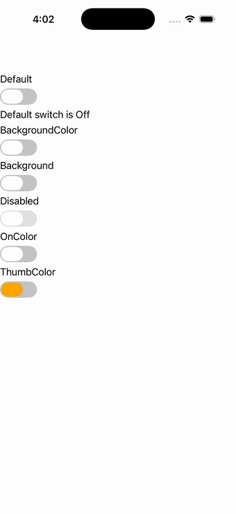

# Switch

Ports .NET MAUI's `SwitchPage` ([oracle](../../../../../src/Controls/samples/Controls.Sample/Pages/Controls/SwitchPage.xaml)) as a code-first `maui::samples::switch_page`. Default / BackgroundColor / Background-gradient (linear brush) / Disabled / OnColor / ThumbColor states for the `toggle_switch`, plus a live readout driven by the Toggled event.

| macOS (AppKit) | iOS (UIKit) |
| --- | --- |
|  |  |

**Running on iOS:**

**Platforms:** macOS ✅ demo · iOS ✅ demo · Windows ⬜ TODO · Linux ⬜ TODO · Android ⬜ TODO

**Run it:**
- macOS — `MAUI_SAMPLE_PAGE=switch ./build/apple/maui_macos_gallery`
- iOS sim — `SIMCTL_CHILD_MAUI_SAMPLE_PAGE=switch xcrun simctl launch booted dev.maui-cpp.ios-gallery`

