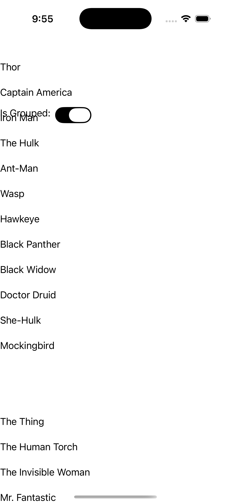
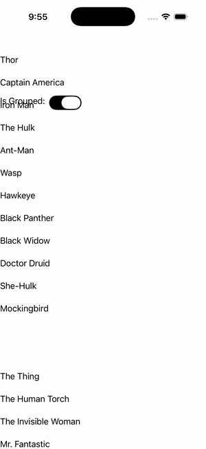

# CollectionView — Switch Grouping

Ports .NET MAUI's `SwitchGrouping` ([oracle](../../../../../src/Controls/samples/Controls.Sample/Pages/Controls/CollectionViewGalleries/GroupingGalleries/SwitchGrouping.xaml)) as a code-first `maui::samples::switch_grouping_page`. A toggle_switch whose `toggled` event sets `collection_view::set_is_grouped` live (the code-first analog of the XAML two-way {Binding IsGrouped}), over a grouped SuperTeams source with header/footer/member templates — opens grouped, flips flat↔grouped on toggle.

| macOS (AppKit) | iOS (UIKit) |
| --- | --- |
|  |  |

**Running on iOS:**

**Platforms:** macOS ✅ demo · iOS ✅ demo · Windows ⬜ TODO · Linux ⬜ TODO · Android ⬜ TODO

**Run it:** `MAUI_SAMPLE_PAGE=switch_grouping ./examples/build/gallery/gallery` (macOS) · `SIMCTL_CHILD_MAUI_SAMPLE_PAGE=switch_grouping xcrun simctl launch booted dev.maui-cpp.ios-gallery` (iOS)
