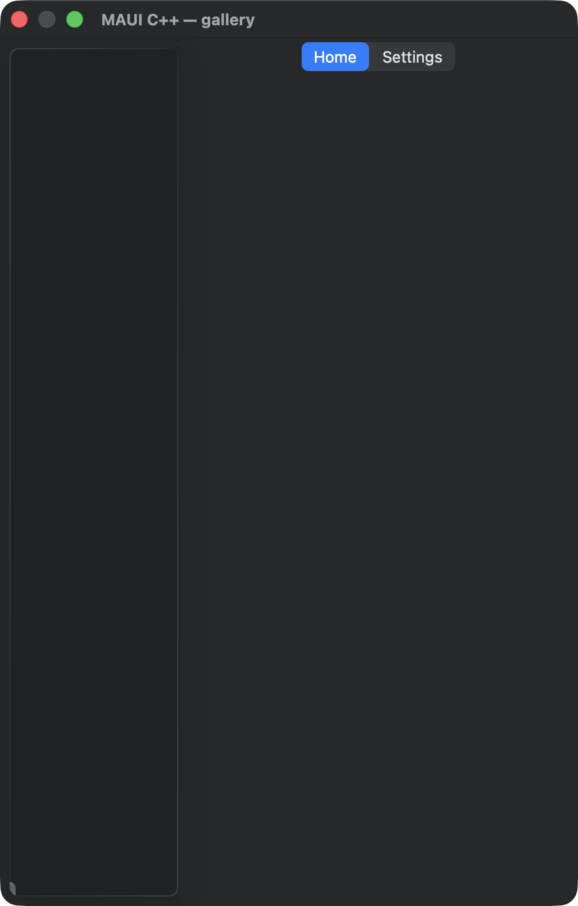

# Tabbed + flyout pages

A `flyout_page` whose flyout pane is a titled menu (two buttons selecting the detail's tabs + a
"Toggle flyout") and whose detail pane is a `tabbed_page` with two tabs. Source:
[`tabbed_flyout_page.hpp`](../../../src/samples/pages/tabbed_flyout_page.hpp).

| macOS (AppKit) | iOS (UIKit) |
| --- | --- |
|  |  |

**Running on iOS:**

**Native controls exercised:** `NSSplitViewController` + `NSTabViewController` (AppKit);
`UISplitViewController` + `UITabBarController` (iOS).

**Platforms:** macOS ✅ demo · iOS ❌ known gap (see note) · Windows ⬜ TODO · Linux ⬜ TODO · Android ⬜ TODO

**Run it:**
- macOS — `MAUI_SAMPLE_PAGE=tabbed_flyout ./build/apple/maui_macos_gallery`
- iOS sim — `SIMCTL_CHILD_MAUI_SAMPLE_PAGE=tabbed_flyout xcrun simctl launch booted dev.maui-cpp.ios-gallery`

> ⚠️ Known gallery-host limitation: on iOS this page renders **blank**. The flyout + tabbed multi-page
> composition is a container-of-pages whose child view controllers need to be installed by a hosting
> navigation/split controller; the minimal gallery host (`ios_gallery.mm`) only `measure`/`arrange`s a
> single root page, so the nested page VCs are never presented. The handlers themselves are exercised by
> the headless + on-simulator unit tests (`tabbed_page` / `flyout_page` suites); this is a gap in the
> demo *host*, not the controls. macOS hosts the split/tab structure directly.
