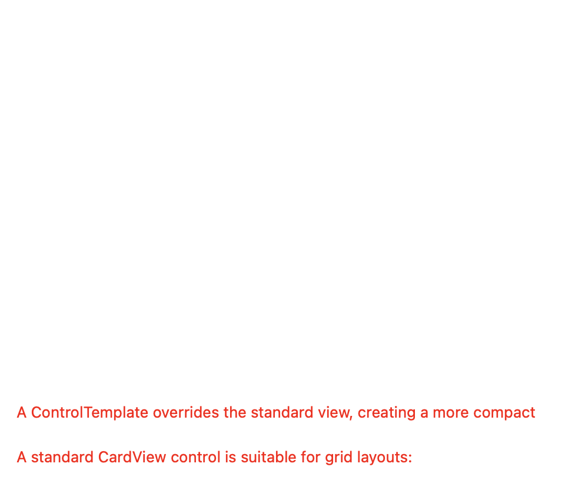
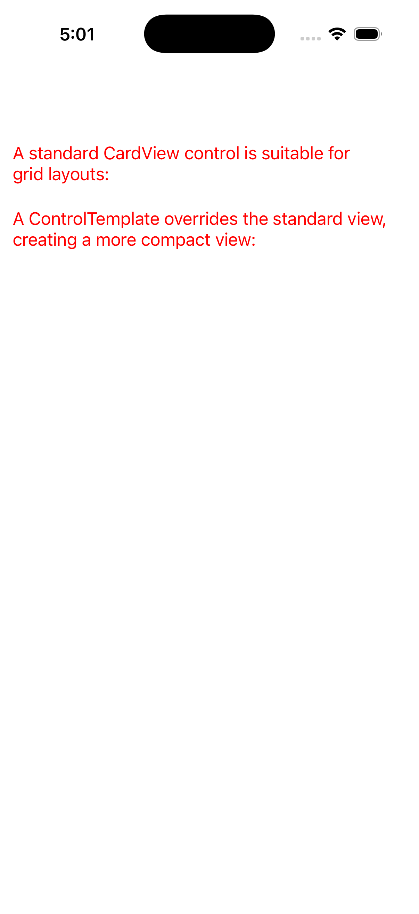
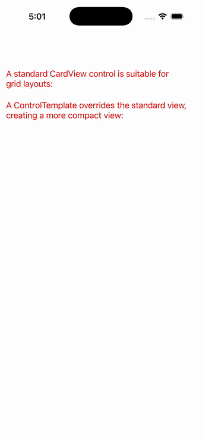

# TemplatedView

Ports .NET MAUI's `TemplatedViewPage` ([oracle](../../../../../src/Controls/samples/Controls.Sample/Pages/Layouts/TemplatedViewPage.xaml)) as a code-first `maui::samples::templated_view_page`. TemplatedView / ControlTemplate via content_view — one un-templated card vs three compact cards each applying a control_template (a loader-minted icon+title+content_presenter subtree).

| macOS (AppKit) | iOS (UIKit) |
| --- | --- |
|  |  |

**Running on iOS:**

**Platforms:** macOS ✅ demo · iOS ✅ demo · Windows ⬜ TODO · Linux ⬜ TODO · Android ⬜ TODO

**Run it:** `MAUI_SAMPLE_PAGE=templated_view ./build/apple/maui_macos_gallery` (macOS) · `SIMCTL_CHILD_MAUI_SAMPLE_PAGE=templated_view xcrun simctl launch booted dev.maui-cpp.ios-gallery` (iOS)

> Notes: CardView/Rate are sample-app controls (not framework types), so their per-property TemplateBindings + heart geometry aren't reproduced — the ControlTemplate-application mechanism is what's shown.
