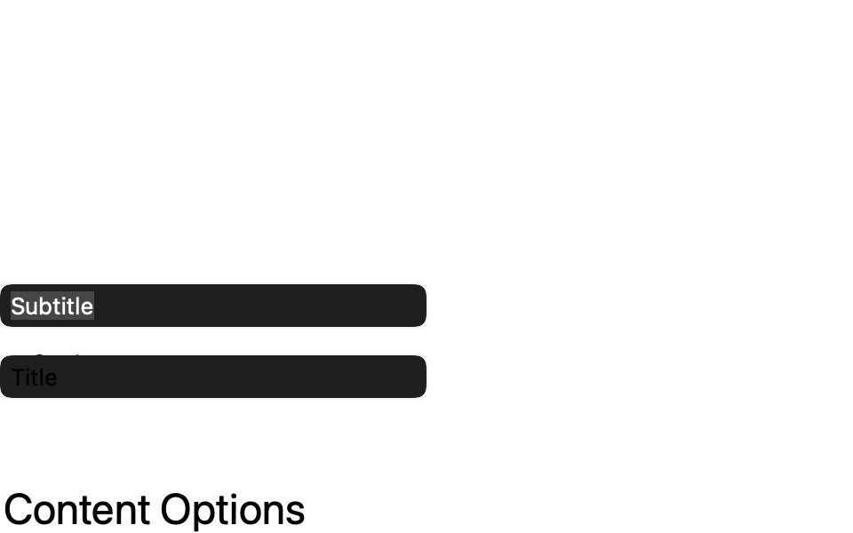
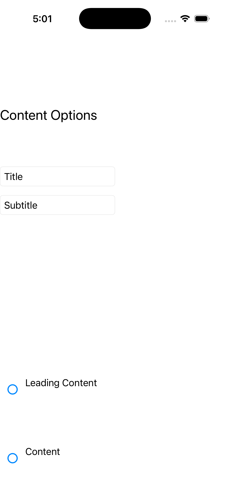

# TitleBar

Ports .NET MAUI's `TitleBarPage` ([oracle](../../../../../src/Controls/samples/Controls.Sample/Pages/Controls/TitleBarPage.xaml)) as a code-first `maui::samples::title_bar_page`. A grid of option panels mutating a custom title_bar: Title/Subtitle entries, a Content checkbox that sets/clears a SearchBar as the bar Content, and Set Color/Foreground buttons running real color parsing.

| macOS (AppKit) | iOS (UIKit) |
| --- | --- |
|  |  |

**Running on iOS:**

**Platforms:** macOS ✅ demo · iOS ✅ demo · Windows ⬜ TODO · Linux ⬜ TODO · Android ⬜ TODO

**Run it:** `MAUI_SAMPLE_PAGE=title_bar ./build/apple/maui_macos_gallery` (macOS) · `SIMCTL_CHILD_MAUI_SAMPLE_PAGE=title_bar xcrun simctl launch booted dev.maui-cpp.ios-gallery` (iOS)

> Notes: C# maps Window.TitleBar on Windows/MacCatalyst only; the port's title_bar is the reduced control (Title/Subtitle/Content) — Icon/Leading-Trailing/Tall/IsVisible/Foreground toggles are preserved + wired to a readout with inline notes.
