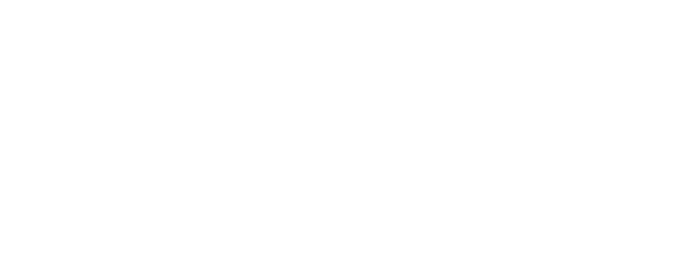
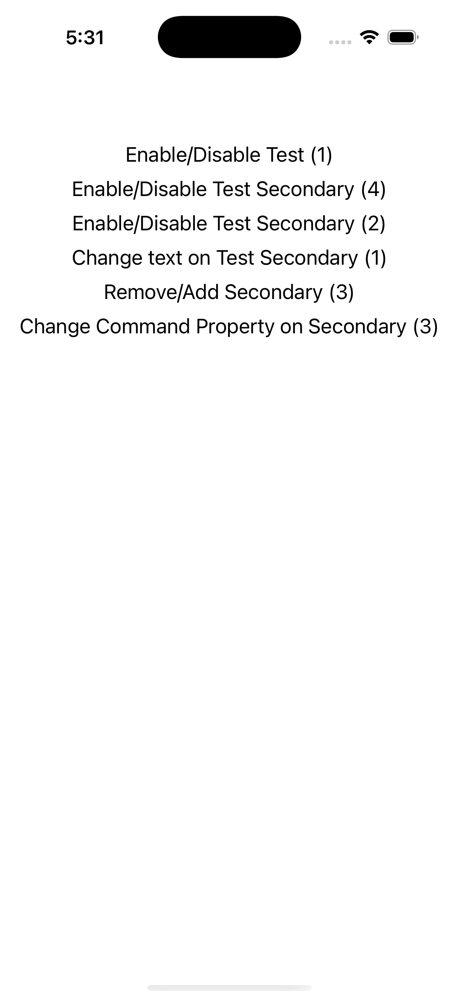
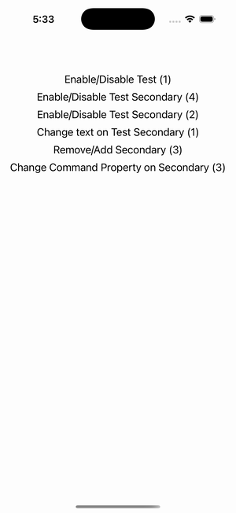

# Toolbar (ToolbarItems)

Ports .NET MAUI's `ToolbarPage` ([oracle](../../../../../src/Controls/samples/Controls.Sample/Pages/Core/ToolbarPage.xaml)) as a code-first `maui::samples::toolbar_page`. Page ToolbarItems CRUD (add/remove/enable/rename/command-swap) exercised programmatically.

| macOS (AppKit) | iOS (UIKit) |
| --- | --- |
|  |  |

**Running on iOS:**

**Platforms:** macOS ✅ demo · iOS ✅ demo · Windows ⬜ TODO · Linux ⬜ TODO · Android ⬜ TODO

**Run it:** `MAUI_SAMPLE_PAGE=toolbar ./build/apple/maui_macos_gallery` (macOS) · `SIMCTL_CHILD_MAUI_SAMPLE_PAGE=toolbar xcrun simctl launch booted dev.maui-cpp.ios-gallery` (iOS)

> `page().toolbar_items()` with 2 primary + 4 secondary items (Order/Priority/IsEnabled/IconImageSource), each clicked handler stamping a readout; runtime-mutator buttons toggle IsEnabled, rename, remove/re-add, and swap an item's command. **The ToolbarItems themselves need a NavigationPage chrome the gallery doesn't mount, so they're exercised via the mutator buttons (which render — see iOS) and the readout, not shown as a native toolbar.** ICommand → a `maui::controls::command` wired into a single clicked connection (menu_item has no ICommand, per port doctrine); the FontImageSource glyph is a file image-source stand-in.
