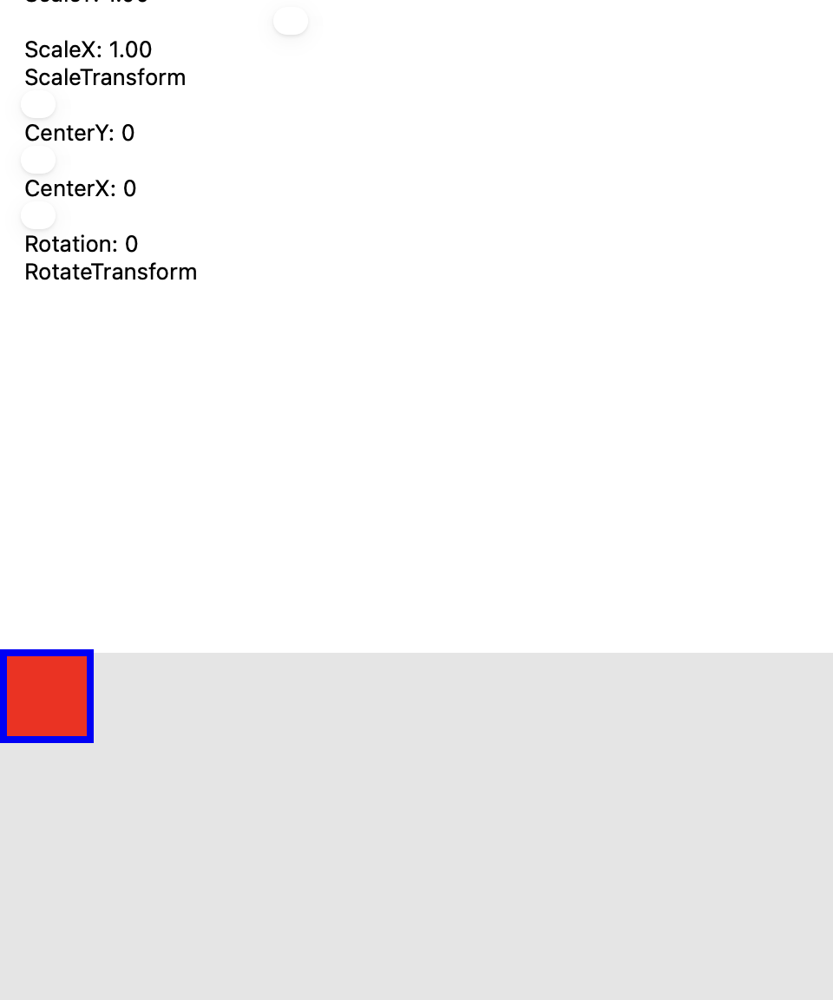
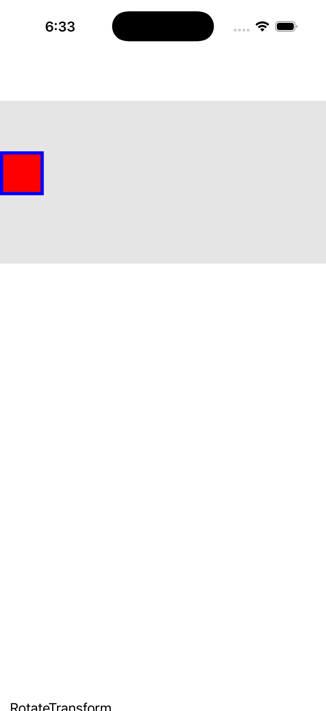
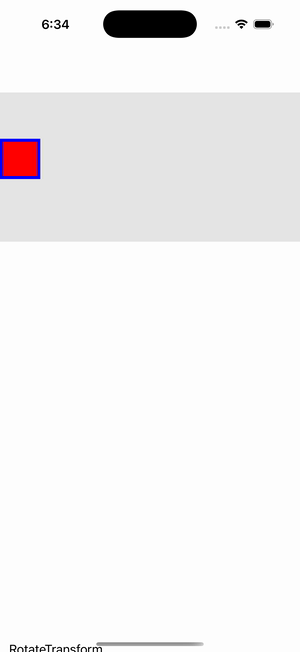

# Transform Playground

Ports .NET MAUI's `TransformPlaygroundGallery` ([oracle](../../../../../src/Controls/samples/Controls.Sample/Pages/Controls/ShapesGalleries/TransformPlaygroundGallery.xaml)) as a code-first `maui::samples::transform_playground_page`. A Path rectangle whose RenderTransform is a live `transform_group` (rotate→scale→skew→translate) driven by sliders — Rotation, shared CenterX/Y, ScaleX/Y, SkewX/Y, TranslateX/Y — each change re-pushing via `path::invalidate_render_transform()`, with per-row readouts.

| macOS (AppKit) | iOS (UIKit) |
| --- | --- |
|  |  |

**Running on iOS:**

**Platforms:** macOS ✅ demo · iOS ✅ demo · Windows ⬜ TODO · Linux ⬜ TODO · Android ⬜ TODO

**Run it:** `MAUI_SAMPLE_PAGE=transform_playground ./examples/build/gallery/gallery` (macOS) · `SIMCTL_CHILD_MAUI_SAMPLE_PAGE=transform_playground xcrun simctl launch booted dev.maui-cpp.ios-gallery` (iOS)

> Natively-rendered shape demo — the Shape family draws through the graphics_view / shape_view handler over a CoreGraphics canvas.
