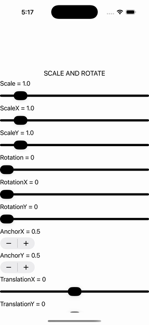

# Transformations

Ports .NET MAUI's `TransformationsPage` ([oracle](../../../../../src/Controls/samples/Controls.Sample/Pages/Core/TransformationsPage.xaml)) as a code-first `maui::samples::transformations_page`. Slider- and stepper-driven view transforms pushed onto one target button with live readouts.

| macOS (AppKit) | iOS (UIKit) |
| --- | --- |
|  |  |

**Running on iOS:**

**Platforms:** macOS ✅ demo · iOS ✅ demo · Windows ⬜ TODO · Linux ⬜ TODO · Android ⬜ TODO

**Run it:** `MAUI_SAMPLE_PAGE=transformations ./examples/build/gallery/gallery` (macOS) · `SIMCTL_CHILD_MAUI_SAMPLE_PAGE=transformations xcrun simctl launch booted dev.maui-cpp.ios-gallery` (iOS)

> Scale/ScaleX/ScaleY + Rotation/RotationX/RotationY sliders (max 10 / 360), AnchorX/AnchorY steppers (range -1..2, step 0.5), plus Translation X/Y. The XAML two-way `{Binding StringFormat}` rows are reproduced as explicit handler-driven snprintf readouts. Skew is correctly N/A — MAUI's `View` has no Skew property either.
