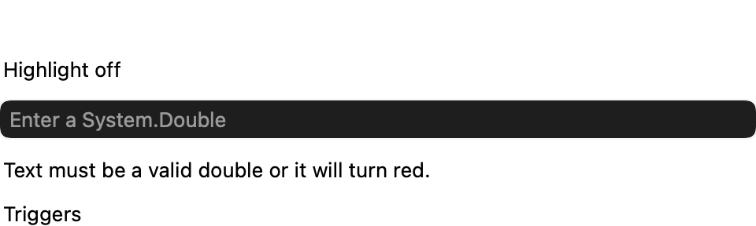
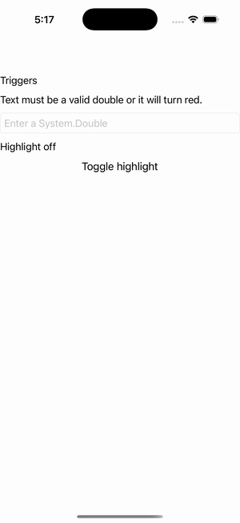

# Triggers

Ports .NET MAUI's `TriggersPage` ([oracle](../../../../../src/Controls/samples/Controls.Sample/Pages/UserInterface/TriggersPage.xaml)) as a code-first `maui::samples::triggers_page`. `property_trigger` reacting to control state, at trigger specificity with RAII handles.

| macOS (AppKit) | iOS (UIKit) |
| --- | --- |
|  |  |

**Running on iOS:**

**Platforms:** macOS ✅ demo · iOS ✅ demo · Windows ⬜ TODO · Linux ⬜ TODO · Android ⬜ TODO

**Run it:** `MAUI_SAMPLE_PAGE=triggers ./build/apple/maui_macos_gallery` (macOS) · `SIMCTL_CHILD_MAUI_SAMPLE_PAGE=triggers xcrun simctl launch booted dev.maui-cpp.ios-gallery` (iOS)

> A `property_trigger<bool>` recoloring an entry's text red while invalid (the NumericValidationTriggerAction logic, driven from `text_changed` parsing the text as a double) + a button-toggled trigger recoloring a status label, both at `setter_specificity::trigger` with RAII `trigger_handle`s. The entry registers no "text_changed" named-event channel, so the EventTrigger is wired via the entry's public `text_changed` event directly (the equivalent reflection-free seam).
