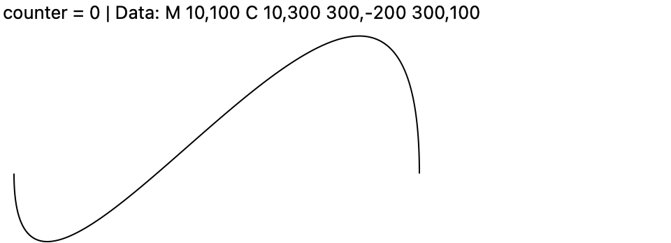
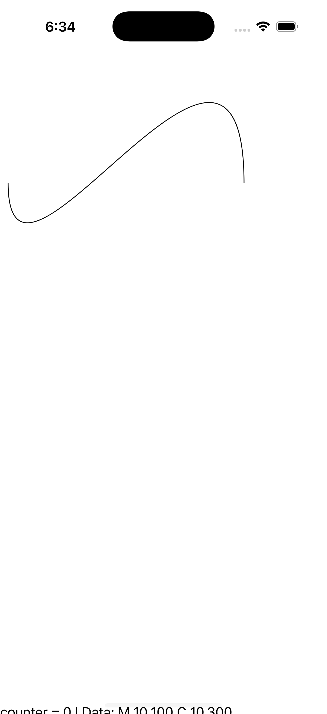
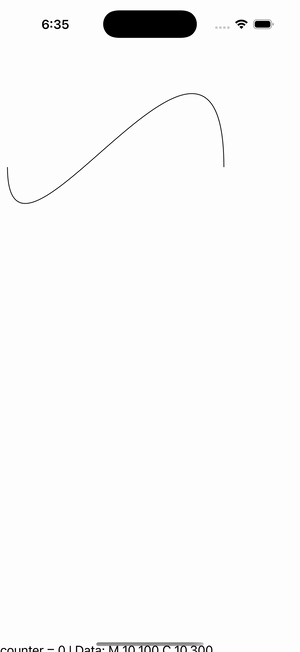

# Update Path Data

Ports .NET MAUI's `UpdatePathDataGallery` ([oracle](../../../../../src/Controls/samples/Controls.Sample/Pages/Controls/ShapesGalleries/UpdatePathDataGallery.xaml)) as a code-first `maui::samples::update_path_data_page`. A black-stroked cubic-Bézier Path whose Data geometry is **replaced** on each 'Update Path Data' tap (`M 10,100 C 10,{300+c} {300+c},-200 {300+c},100`, c+=10), repainting the growing curve, + a status readout. A new `shared_ptr<path_geometry>` fires the 'data' mapper so the Path repaints.

| macOS (AppKit) | iOS (UIKit) |
| --- | --- |
|  |  |

**Running on iOS:**

**Platforms:** macOS ✅ demo · iOS ✅ demo · Windows ⬜ TODO · Linux ⬜ TODO · Android ⬜ TODO

**Run it:** `MAUI_SAMPLE_PAGE=update_path_data ./examples/build/gallery/gallery` (macOS) · `SIMCTL_CHILD_MAUI_SAMPLE_PAGE=update_path_data xcrun simctl launch booted dev.maui-cpp.ios-gallery` (iOS)

> Natively-rendered shape demo — the Shape family draws through the graphics_view / shape_view handler over a CoreGraphics canvas.
