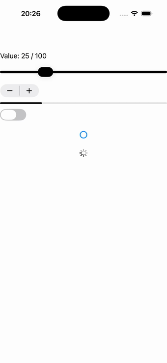

# Value controls

Switches, checkboxes, sliders, steppers, progress bars and activity indicators on one vertical
stack — every input drives a visible output: the slider feeds the progress bar + readout, the stepper
steps the slider, the switch starts/stops the spinner, the checkbox recolours the slider thumb.
Source: [`value_controls_page.hpp`](../../../src/samples/pages/value_controls_page.hpp).

| macOS (AppKit) | iOS (UIKit) |
| --- | --- |
|  |  |

**Running on iOS:**

**Native controls exercised:** `NSSwitch`/`UISwitch`, drawn `MauiCheckBox`, `NSSlider`/`UISlider`,
`NSStepper`/`UIStepper`, `NSProgressIndicator`/`UIProgressView`, spinning activity indicator, label.

**Platforms:** macOS ✅ demo · iOS ✅ demo · Windows ⬜ TODO · Linux ⬜ TODO · Android ⬜ TODO

**Run it:**
- macOS — `MAUI_SAMPLE_PAGE=value_controls ./build/apple/maui_macos_gallery`
- iOS sim — `SIMCTL_CHILD_MAUI_SAMPLE_PAGE=value_controls xcrun simctl launch booted dev.maui-cpp.ios-gallery`

> macOS arranges the stack from the bottom up (AppKit unflipped-view layout deviation), so the spacing
> differs from iOS; all seven controls render natively on both.
