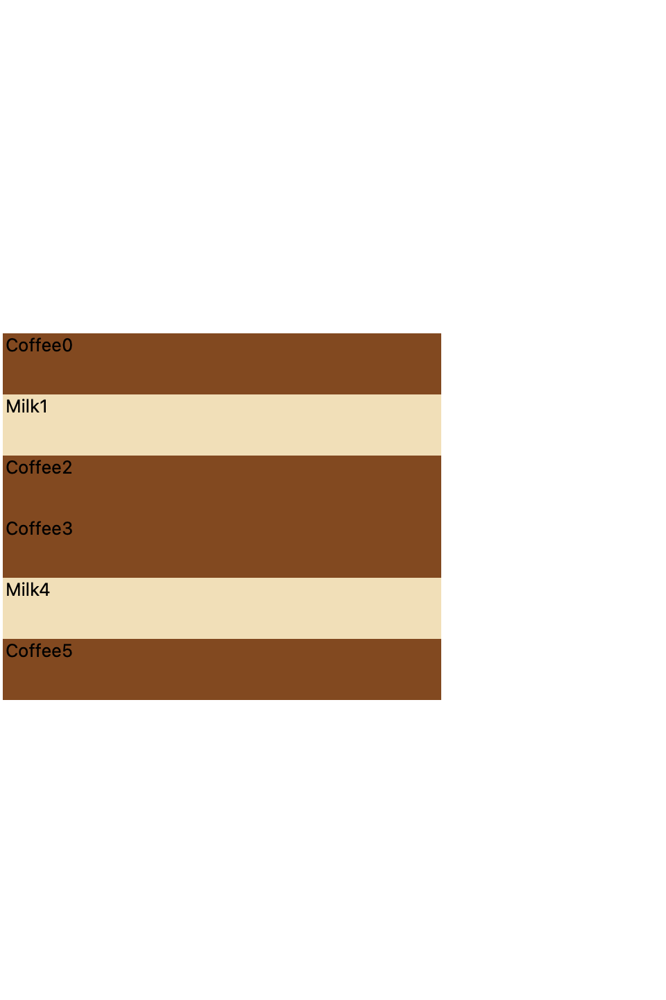
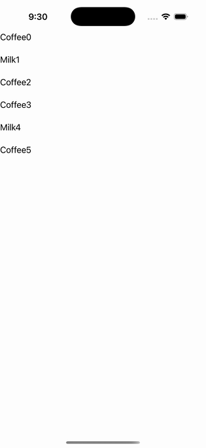

# CollectionView — Varied-Size Template Selector

Ports .NET MAUI's `VariedSizeDataTemplateSelectorGallery` ([oracle](../../../../../src/Controls/samples/Controls.Sample/Pages/Controls/CollectionViewGalleries/DataTemplateSelectorGalleries/VariedSizeDataTemplateSelectorGallery.xaml)) as a code-first `maui::samples::varied_size_selector_page`. A data_template_selector choosing Milk(HeightRequest 100) / Coffee(50) / Latte(auto) templates of differing size per item, with ItemSizingStrategy=MeasureAllItems + a full control panel (Insert/Add/Remove + Index entry + drink Picker) driving the live ObservableCollection (DrinkBase collapsed to one struct + kind discriminator the selector branches on).

| macOS (AppKit) | iOS (UIKit) |
| --- | --- |
|  |  |

**Running on iOS:**

**Platforms:** macOS ✅ demo · iOS ✅ demo · Windows ⬜ TODO · Linux ⬜ TODO · Android ⬜ TODO

**Run it:** `MAUI_SAMPLE_PAGE=varied_size_selector ./examples/build/gallery/gallery` (macOS) · `SIMCTL_CHILD_MAUI_SAMPLE_PAGE=varied_size_selector xcrun simctl launch booted dev.maui-cpp.ios-gallery` (iOS)

> Struct-typed item cells render their template-bound content natively (post the TemplatedCell.Bind fix).
